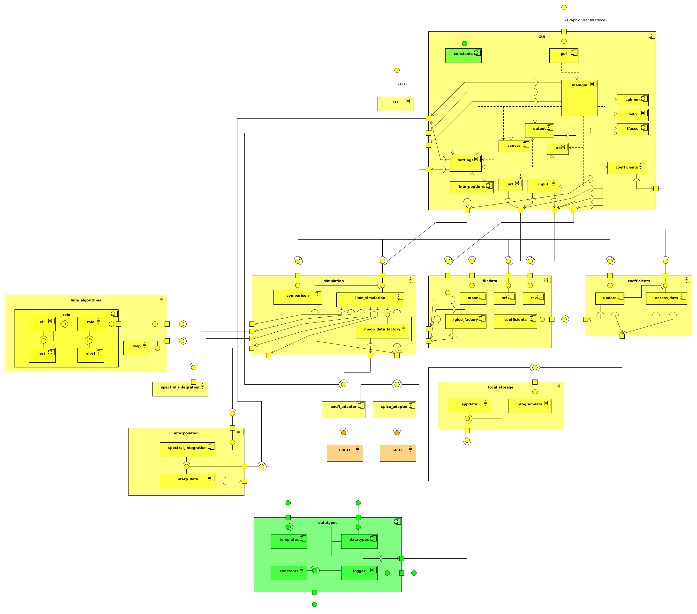

# LIME Toolbox

[](https://gitlab.npl.co.uk/eco/eo/lime_tbx/-/tags) [](https://www.gnu.org/licenses/lgpl-3.0)


<!-- PROJECT LOGO -->
<br />
<div align="center">
  <a href="https://lime.uva.es">
    
  </a>

  <h3 align="center">lime_tbx</h3>

  <p align="center">
    Run the LIME model, simulate lunar observations and compare them with real remote sensing data.
    <br />
    <a href="https://eco.gitlab-docs.npl.co.uk/eo/lime_tbx/"><strong>Explore the docs »</strong></a>
    <!--<br />
    <br />
    <a href="https://github.com/LIME-ESA/lime_tbx">View Demo</a>
    ·
    <a href="https://github.com/LIME-ESA/lime_tbx/issues/new?labels=bug&template=bug-report---.md">Report Bug</a>
    ·
    <a href="https://github.com/LIME-ESA/lime_tbx/issues/new?labels=enhancement&template=feature-request---.md">Request Feature</a>-->
  </p>
</div>


<!-- TABLE OF CONTENTS -->
<details>
  <summary>Table of Contents</summary>
  <ol>
    <li>
      <a href="#about-the-project">About The Project</a>
      <ul>
        <li><a href="#built-with">Built With</a></li>
      </ul>
    </li>
    <li>
      <a href="#getting-started">Getting Started</a>
      <ul>
        <li><a href="#prerequisites">Prerequisites</a></li>
        <li><a href="#installation">Installation</a></li>
      </ul>
    </li>
    <li><a href="#usage">Usage</a></li>
    <li><a href="#roadmap">Roadmap</a></li>
    <li>
      <a href="#contributing">Contributing</a>
      <ul>
        <li><a href="#development">Development</a></li>
        <li><a href="#testing">Testing</a></li>
        <li><a href="#deployment">Deployment</a></li>
      </ul>
    </li>
    <li><a href="#license">License</a></li>
    <!--<li><a href="#contact">Contact</a></li>-->
    <li><a href="#authors">Authors</a></li>
  </ol>
</details>


## About the project

<div align="center">
    <a href="https://github.com/LIME-ESA/lime_tbx">
        
    </a>
</div>

The *lime_tbx* is a Python package that provides a comprehensive toolbox
for utilizing the Lunar Irradiance Model of ESA (LIME) to simulate lunar
observations and compare them with remote sensing data of the Moon.

LIME is the Lunar Irradiance Model of the European Space Agency (ESA),
which aims to determine an improved lunar irradiance model with sub-2%
radiometric uncertainty.

This project is managed, financed and supported by the European Space
Agency (ESA).
  
More information about LIME can be found on [lime.uva.es](https://lime.uva.es).

### Built with

* [](https://www.python.org/)
* [](https://www.qt.io/)
* [](https://naif.jpl.nasa.gov/naif/)
* [![EOCFI][eocfi-badge]](https://eop-cfi.esa.int/index.php/mission-cfi-software/eocfi-software)

## Getting started

The LIME Toolbox is designed as an standalone desktop application that one
can directly install without the need of installing Python or any other kind
of software used in its development.

### Prerequisites

The LIME Toolbox is compatible with the following operating systems and architectures:
- Windows 10 with x86_64 arch.
- Linux with GLIBC >= 2.23 and x86_64 arch.
- Mac with x86_64 arch. or with ARM64 arch. and Rosetta interpreter.

### Installation

One can download and install LIME TBX as a standalone desktop application
on [lime.uva.es/downloads](https://lime.uva.es/downloads/).

Another option is installing the python package and its dependencies
by using:
```sh
pip install -e .
```

## Usage

Usage examples.

## Roadmap

- [ ] Toolbox compilation through Docker
    - [ ] Linux
    - [ ] Windows
    - [ ] Mac
- [ ] Allow coefficients of more than six wavelengths, being as flexible as possible. (**NFR107**)
    - [x] The TBX must accept coefficients that also include data for the 1088 CIMEL photometer's 2130 nm band. (**NFR107-A**)
    - [ ] The TBX must accept coefficients made for any response function specified in the coefficients file. (**NFR107-B**)
- [ ] Improve the speed of uncertainties calculation. (**NFR306**)


See the [open issues](https://github.com/LIME-ESA/lime_tbx/issues) for a full list of proposed features (and known issues).

## Contributing

If you wish to contribute to the *lime_tbx* project, please check the [contributing](./CONTRIBUTING.md) guide.

### Development

If you are developing the package, you'll want to install the pre-commit
hooks as well. Type:
```sh
pre-commit install
```

Note that from now on when you commit, `black` will check your code for styling
errors. If it finds any it will correct them, but the commit will be aborted.
This is so that you can check its work before you continue. If you're happy,
just commit again.

The project dependencies can be installed with:
```sh
pip install -r requirements.txt
```

The project composite structure is explained in
quality_documentation/uml/composite_structure.png:

<div align="center">
<a href="./quality_documentation/uml/composite_structure.png">
  
</a>
</div>


### Testing

To perform the unit tests one must run:
```sh
python3 -m unittest
```

To perform the coverage tests one must type:
```sh
./coverage_run.sh
```


### Deployment

Requirements:

- python 3.8 (Linux) or python 3.9 (Mac and Windows).
- pyinstaller (installed outside of the virtual environment).

It is strongly recommended to create the app-bundle using a virtual
environment (venv) in order to minimize the application size. Inside of
it, the project dependencies can be installed with:

    pip install -r requirements.txt

Create a desktop app-bundle for your OS by using:

    pyinstaller lime_tbx.spec

Now you can deactivate the virtual environment. You may create an installer
for your OS under the installer directory. For Windows you must use
"InnoSetup", for Mac and Linux you must execute the scripts
"build_mac_installer.sh" and "build_linux_installer.sh" respectively,
and for Debian you must execute the "build_deb.sh" script.

For more information about the recommended environments for the production
of TBX binaries please check the installer directory.


## License

Distributed under the LGPL-v3 License. See [LGPL v3](./LICENSE) for more information.


## Authors

* [Javier Gatón Herguedas](gaton@goa.uva.es) - [GOA-UVa](https://goa.uva.es)
* [Pieter De Vis](pieter.de.vis@npl.co.uk) - [NPL](https://npl.co.uk)
* [Stefan Adriaensen](stefan.adriaensen@vito.be) - [VITO](https://vito.be)
* [Jacob Fahy](jacob.fahy@npl.co.uk) - [NPL](https://npl.co.uk)
* [Ramiro González Catón](ramiro@goa.uva.es) - [GOA-UVa](https://goa.uva.es)
* [Carlos Toledano](toledano@goa.uva.es) - [GOA-UVa](https://goa.uva.es)
* [África Barreto](abarretov@aemet.es) - [AEMET](https://aemet.es)
* [Agnieszka Bialek](agnieszka.bialek@npl.co.uk) - [NPL](https://npl.co.uk)
* [Marc Bouvet](marc.bouvet@esa.int) - [ESA](https://esa.int)


<div align="center">
<a href="https://esa.int"></a> <a href="https://uva.es"></a> <a href="https://npl.co.uk"></a> <a href="https://vito.be"></a>
</div>

[eocfi-badge]: https://img.shields.io/badge/eocfi-e8e8e4?style=for-the-badge&logo=data:image/svg%2bxml;base64,PD94bWwgdmVyc2lvbj0iMS4wIiBlbmNvZGluZz0iVVRGLTgiIHN0YW5kYWxvbmU9Im5vIj8+DQo8IS0tIENyZWF0ZWQgd2l0aCBJbmtzY2FwZSAoaHR0cDovL3d3dy5pbmtzY2FwZS5vcmcvKSAtLT4NCjxzdmcgeG1sbnM6c3ZnPSJodHRwOi8vd3d3LnczLm9yZy8yMDAwL3N2ZyIgeG1sbnM9Imh0dHA6Ly93d3cudzMub3JnLzIwMDAvc3ZnIiB2ZXJzaW9uPSIxLjAiIHdpZHRoPSIyNDIuODg2MDYiIGhlaWdodD0iMjQyLjk3NTEzIiBpZD0ic3ZnMjQyOSI+DQogIDxkZWZzIGlkPSJkZWZzMjQzMSIvPg0KICA8ZyB0cmFuc2Zvcm09InRyYW5zbGF0ZSgtMjg0LjM0NTI5LC0zMTAuODc0NjIpIiBpZD0ibGF5ZXIxIj4NCiAgICA8cGF0aCBkPSJNIDQ0MS4yNzY1Niw0MjEuNjkwOTEgTCA0ODkuMDY4NTEsNDIxLjY5MDkxIEMgNDg5LjA2ODUxLDQyMS42OTA5MSA0OTAuOTU5NDIsNDE0LjUwNjQ3IDQ4Mi40NDgsNDAzLjczNTU2IEMgNDY1LjYzNTc4LDM4Ni4zNjI0NSA0NDYuNzUwOTYsMzk3Ljg4NDI1IDQ0Ni43NTA5NiwzOTcuODg0MjUgQyA0MzcuNDkwOTcsNDAyLjc5NDY2IDQyNS41OTgyNyw0MjMuMTk5NTEgNDMyLjU3NTIsNDUyLjQ4MDU3IEMgNDQxLjI3NjU2LDQ4MS43Njc3NyA0NzQuNzA4MDIsNDg3Ljc5NDQ0IDQ5NS40ODA3LDQ4MC45OTU5IEMgNTA5LjIyOTM1LDQ3Ni40OTgxNSA1MTcuMTU2MjgsNDY2LjU4MjU4IDUyMC45NzA4Miw0NjAuMzYyNjQgQyA1MjIuMTk3NDksNDU1LjMzMDYyIDUyMy4wNzMwMiw0NTAuMjk4NTQgNTIzLjYyNDc5LDQ0NS4yOTYxMyBMIDQ0MS4yNzY1Niw0NDUuMjk2MTMgTCA0NDEuMjc2NTYsNDIxLjY5MDkxIHoiIGlkPSJwYXRoMjQyNSIgc3R5bGU9ImZpbGw6IzAwMzI0NztmaWxsLW9wYWNpdHk6MTtmaWxsLXJ1bGU6bm9uemVybztzdHJva2U6bm9uZSIvPg0KICAgIDxwYXRoIHN0eWxlPSJmaWxsOiMwMDMyNDc7ZmlsbC1vcGFjaXR5OjE7ZmlsbC1ydWxlOm5vbnplcm87c3Ryb2tlOm5vbmUiIGlkPSJwYXRoMjQyMyIgZD0iTSAzOTkuNTAzMTMsMzE0LjA0ODQgQyAzNDkuMDcxNDQsMzE2LjczMDg4IDMwNC4wNzc5MiwzNTEuNjMzNjEgMjkxLjAxMTIzLDQwMy4xNTk5NiBDIDI3NC45MjMyNiw0NjYuNTgyMjggMzEzLjI4NjI0LDUzMS4wOTE1NCAzNzYuNzAyNzMsNTQ3LjE4MjQ4IEMgNDIxLjc2MDE1LDU1OC42MTIzIDQ2Ny40NDk4NCw1NDIuNTYwMDggNDk1LjgzNDgyLDUwOS41NjE4MyBDIDQ4My4zNTM4Nyw1MTIuNTQ1NDYgNDY4Ljc0NzIxLDUxMi43NDQ0IDQ1Mi44OTQwNiw1MDcuMjgxNzkgQyAzOTkuODAzMzYsNDg4Ljk0OTQxIDM5MC4wNzQ0LDQzOS44MTkxNyA0MDMuMzAzMTksNDA1LjQ0IEMgNDE2LjUxNDUzLDM3MS4wNTg1MiA0NjIuNzc0MjMsMzU1LjAzMjg4IDQ5NC44ODQ4LDM3OC4wNzk1MiBDIDUyMi40MDY1OCwzOTcuODE3ODYgNTIzLjkxODQ2LDQzMi45ODUyNSA1MjMuNzY1Myw0NDIuNjgwNjUgQyA1MjguODMwMDksMzg1Ljc4NjQyIDQ5Mi4xNzg4NSwzMzEuOTc2OTkgNDM1LjAzMzc0LDMxNy40Njg0NiBDIDQyMy4xNDMyNCwzMTQuNDUzMDkgNDExLjE0MTI0LDMxMy40MjkzOSAzOTkuNTAzMTMsMzE0LjA0ODQgeiBNIDM0MS43NDIxMSw0MTguNTUwMjMgQyAzNTAuMTYxNjYsNDE4LjU1MDIzIDM1Ni45NDIzOCw0MjUuMzM2MzUgMzU2Ljk0MjM4LDQzMy43NTA1IEMgMzU2Ljk0MjM4LDQ0Mi4xNjk5MiAzNTAuMTYxNjYsNDQ4Ljk1MDc2IDM0MS43NDIxMSw0NDguOTUwNzYgQyAzMzMuMzI4NTksNDQ4Ljk1MDc2IDMyNi4zNTE4NCw0NDIuMTY5OTIgMzI2LjM1MTg0LDQzMy43NTA1IEMgMzI2LjM1MTkxLDQyNS4zMzYzNSAzMzMuMzI4NTksNDE4LjU1MDIzIDM0MS43NDIxMSw0MTguNTUwMjMgeiIvPg0KICA8L2c+DQo8L3N2Zz4=