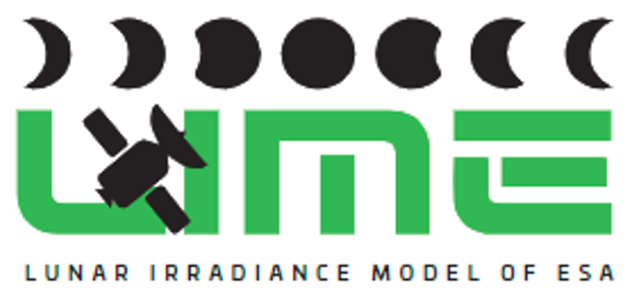
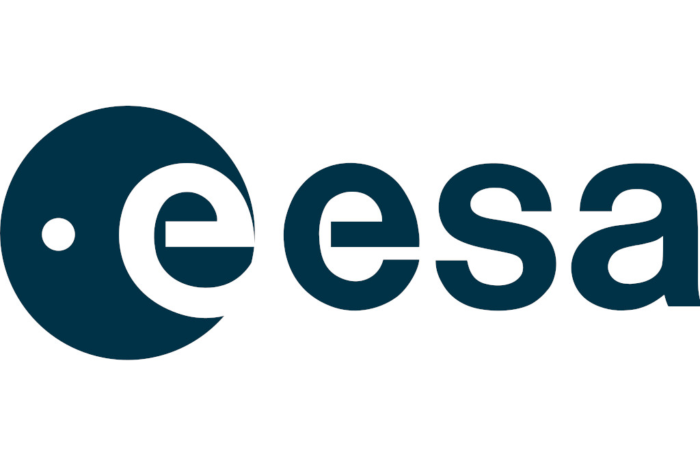
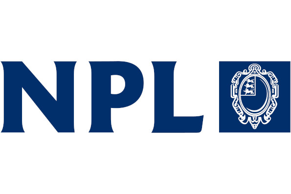

[](https://github.com/LIME-ESA/lime_tbx/tags)
[![License: LGPL 3.0][license-shield]][license-url]
[![Issues][issues-shield]][issues-url]
[![Stargazers][stars-shield]][stars-url]


<!-- PROJECT LOGO -->
<br />
<div align="center">
  <a href="https://lime.uva.es">
    
  </a>

  <h3 align="center">lime_tbx</h3>

  <p align="center">
    Run the LIME model, simulate lunar observations and compare them with real remote sensing data.
    <br />
    <a href="https://lime-esa.github.io/lime_tbx/"><strong>Explore the docs »</strong></a>
    <br />
    <br />
    <!--<a href="https://github.com/LIME-ESA/lime_tbx">View Demo</a>
    ·-->
    <a href="https://github.com/LIME-ESA/lime_tbx/issues/new?labels=bug&template=bug_report.md">Report Bug</a>
    ·
    <a href="https://github.com/LIME-ESA/lime_tbx/issues/new?labels=enhancement&template=feature_request.md">Request Feature</a>
  </p>
</div>


<!-- TABLE OF CONTENTS -->
<details>
  <summary>Table of Contents</summary>
  <ol>
    <li>
      <a href="#about-the-project">About The Project</a>
      <ul>
        <li><a href="#collaborators">Collaborators</a></li>
        <li><a href="#built-with">Built With</a></li>
      </ul>
    </li>
    <li>
      <a href="#getting-started">Getting Started</a>
      <ul>
        <li><a href="#prerequisites">Prerequisites</a></li>
        <li><a href="#installation">Installation</a></li>
      </ul>
    </li>
    <li><a href="#usage">Usage</a></li>
    <li><a href="#roadmap">Roadmap</a></li>
    <li>
      <a href="#development-guide">Development Guide</a>
      <ul>
        <li><a href="#versioning">Versioning</a></li>
        <li><a href="#setting-up-the-environment">Setting Up the Environment</a></li>
        <li><a href="#project-structure">Project Structure</a></li>
        <li><a href="#testing">Testing</a></li>
        <li><a href="#deployment">Deployment</a></li>
      </ul>
    </li>
    <li><a href="#license">License</a></li>
    <li><a href="#authors">Authors</a></li>
  </ol>
</details>


## About the project

<div align="center">
    <a href="https://github.com/LIME-ESA/lime_tbx">
        
    </a>
</div>

The `lime_tbx` is a Python package that provides a comprehensive toolbox
for utilizing the Lunar Irradiance Model of ESA (LIME) to simulate lunar
observations and compare them with remote sensing data of the Moon.

LIME is the Lunar Irradiance Model of the European Space Agency (ESA),
which aims to determine an improved lunar irradiance model with sub-2%
radiometric uncertainty.
  
More information about LIME can be found on [lime.uva.es](https://lime.uva.es).

### Collaborators

This project is managed, financed and supported by the European Space
Agency ([ESA](https://esa.int)).

The project is a collaboration between multiple institutions, including:
- [NPL](https://npl.co.uk) (National Physics Laboratory, United Kingdom)
- [UVa](https://uva.es) (Universidad de Valladolid, Spain)
- [VITO](https://vito.be) (Vlaamse Instelling voor Technologisch Onderzoek, Belgium)


### Built with

* [](https://www.python.org/)
* [](https://www.qt.io/)
* [](https://naif.jpl.nasa.gov/naif/)
* [![EO-CFI][eocfi-badge]](https://eop-cfi.esa.int/index.php/mission-cfi-software/eocfi-software)
* [![CoMet Toolkit][comet-toolkit-badge]](https://www.comet-toolkit.org/)

## Getting started

The LIME Toolbox is designed as an standalone desktop application that one
can directly install without the need of installing Python or any other
software used in its development. Nevertheless, it can be installed as a
Python package.

### Prerequisites

The LIME Toolbox is compatible with the following operating systems and architectures:
- Windows 10 with x86_64 arch.
- Linux with GLIBC >= 2.23 and x86_64 arch.
- Mac with x86_64 arch. or with ARM64 arch. and Rosetta interpreter.

### Installation

One can download and install LIME TBX as a standalone desktop application
on [lime.uva.es/downloads](https://lime.uva.es/downloads/).

Another option is installing the python package and its dependencies
by using:
```sh
pip install -e .
```

This project uses Qt for GUI development, and it relies on `qtpy` to manage
compatibility between different Qt bindings (`PySide2` and `PySide6`).
However, since qtpy does not include a Qt binding by default, you must specify which one to install.
- Install with PySide6 (Recommended)
  ```sh
  pip install -e ".[pyside6]"
  ```
  PySide6 provides the latest Qt features and long-term support.

- Install with PySide2 (For Legacy Compatibility)
  ```sh
  pip install -e ".[pyside2]"
  ```
  Use PySide2 if you need compatibility with older Qt5-based applications, or you
  need to install it in an old OS.

## Usage

Check the [online documentation's User Guide](https://lime-esa.github.io/lime_tbx/content/user_guide/overview.html)
or download the [User Guide File](https://calvalportal.ceos.org/documents/10136/964157/DA10_user_guide_v0.docx/b4724686-d758-5625-c1f4-9498c9b69c0d?version=1.0&t=1708947381404&download=true)
to fully explore the capabilities of the toolbox.

## Roadmap

- [x] New feature: Simulate Angle of Lunar Polarisation (AoLP)
- [ ] Allow coefficients of more than six wavelengths, being as flexible as possible. (**NFR108**)
    - [x] The TBX must accept coefficients that also include data for the 1088 CIMEL photometer's 2130 nm band. (**NFR108-A**)
    - [ ] The TBX must accept coefficients made for any response function specified in the coefficients file. (**NFR108-B**)
- [ ] Sign installers with official certificates
- [ ] Fully migrate project to GitHub (issues, CI pipeline, etc.)
- [ ] Automate Mac Build & Packaging Process through Github actions (**NFR409-C**)
- [ ] Allow users to simulate series of lunar observations, where not only the time varies. (**FR107**)


See the [open issues](https://github.com/LIME-ESA/lime_tbx/issues) for a full list of proposed features (and known issues).

If you wish to contribute to the `lime_tbx` project, please check the <a href="./CONTRIBUTING.md">Contributing Guide</a>.

## Development Guide

For a detailed description on how the Toolbox is structured and implemented please refer
to the official [documentation](https://lime-esa.github.io/lime_tbx/),
specially the **Design** and **Implementation** sections, under Technical Details.

### Versioning

Version changes and descriptions are stored in the <a href="./CHANGELOG.md">CHANGELOG</a>.
This file is updated each time a new version is released.

### Setting Up the Environment

To prepare your environment for development, testing or deployment, follow these steps:

1. **Install Pre-commit Hooks**
    Install the `pre-commit` hooks to automatically check code styling:
    ```sh
    pre-commit install  
    ```

    - When you commit changes, `black` will check your code for styling errors.
    - If errors are found, they will be corrected, and the commit will be aborted to allow you to review the changes.
    - If you're satisfied, reattempt the commit.

2. **Install Python Dependencies**
    1. **Install requirements.txt**

        Install the python package dependencies listed in the `requirements.txt` file, preferably in a python virtual enironment:
        ```sh
        pip install -r requirements.txt  
        ```

    2. **Install a Qt binding**
        
        As previously explained, this project relies on `qtpy` to manage compatibility between different Qt
        bindings. Since qtpy does not include a Qt binding by default, you must install your preferred `QT`
        binding package manually. For example, `PySide6`:
        ```sh
        pip install PySide6
        ```

### Testing

Run the following commands to ensure the code works as expected:

1. **Unit Tests**  
    To perform unit tests:
    ```sh
    python3 -m unittest  
    ```

2. **Coverage Tests**  
    To generate a coverage report:
    ```sh
    ./coverage_run.sh  
    ```


## License

Distributed under the LGPL-v3 License. See [LGPL v3](./LICENSE) for more information.


## Authors

* [Javier Gatón Herguedas](mailto:gaton@goa.uva.es) - [GOA-UVa](https://goa.uva.es)
* [Pieter De Vis](mailto:pieter.de.vis@npl.co.uk) - [NPL](https://npl.co.uk)
* [Stefan Adriaensen](mailto:stefan.adriaensen@vito.be) - [VITO](https://vito.be)
* [Jacob Fahy](mailto:jacob.fahy@npl.co.uk) - [NPL](https://npl.co.uk)
* [Ramiro González Catón](mailto:ramiro@goa.uva.es) - [GOA-UVa](https://goa.uva.es)
* [Carlos Toledano](mailto:toledano@goa.uva.es) - [GOA-UVa](https://goa.uva.es)
* [África Barreto](mailto:abarretov@aemet.es) - [AEMET](https://aemet.es)
* [Agnieszka Bialek](mailto:agnieszka.bialek@npl.co.uk) - [NPL](https://npl.co.uk)
* [Marc Bouvet](mailto:marc.bouvet@esa.int) - [ESA](https://esa.int)

---

<div align="center">
<a href="https://esa.int"></a><a href="https://uva.es"></a><a href="https://npl.co.uk"></a><a href="https://vito.be" ></a>
</div>


[stars-shield]: https://img.shields.io/github/stars/LIME-ESA/lime_tbx.svg?style=for-the-badge
[stars-url]: https://github.com/LIME-ESA/lime_tbx/stargazers
[issues-shield]: https://img.shields.io/github/issues/LIME-ESA/lime_tbx.svg?style=for-the-badge
[issues-url]: https://github.com/LIME-ESA/lime_tbx/issues
[license-shield]: https://img.shields.io/github/license/LIME-ESA/lime_tbx.svg?style=for-the-badge
[license-url]: https://github.com/LIME-ESA/lime_tbx/blob/master/LICENSE

[eocfi-badge]: https://img.shields.io/badge/eo--cfi-e8e8e4?style=for-the-badge&logo=data:image/svg%2bxml;base64,PD94bWwgdmVyc2lvbj0iMS4wIiBlbmNvZGluZz0iVVRGLTgiIHN0YW5kYWxvbmU9Im5vIj8+DQo8IS0tIENyZWF0ZWQgd2l0aCBJbmtzY2FwZSAoaHR0cDovL3d3dy5pbmtzY2FwZS5vcmcvKSAtLT4NCjxzdmcgeG1sbnM6c3ZnPSJodHRwOi8vd3d3LnczLm9yZy8yMDAwL3N2ZyIgeG1sbnM9Imh0dHA6Ly93d3cudzMub3JnLzIwMDAvc3ZnIiB2ZXJzaW9uPSIxLjAiIHdpZHRoPSIyNDIuODg2MDYiIGhlaWdodD0iMjQyLjk3NTEzIiBpZD0ic3ZnMjQyOSI+DQogIDxkZWZzIGlkPSJkZWZzMjQzMSIvPg0KICA8ZyB0cmFuc2Zvcm09InRyYW5zbGF0ZSgtMjg0LjM0NTI5LC0zMTAuODc0NjIpIiBpZD0ibGF5ZXIxIj4NCiAgICA8cGF0aCBkPSJNIDQ0MS4yNzY1Niw0MjEuNjkwOTEgTCA0ODkuMDY4NTEsNDIxLjY5MDkxIEMgNDg5LjA2ODUxLDQyMS42OTA5MSA0OTAuOTU5NDIsNDE0LjUwNjQ3IDQ4Mi40NDgsNDAzLjczNTU2IEMgNDY1LjYzNTc4LDM4Ni4zNjI0NSA0NDYuNzUwOTYsMzk3Ljg4NDI1IDQ0Ni43NTA5NiwzOTcuODg0MjUgQyA0MzcuNDkwOTcsNDAyLjc5NDY2IDQyNS41OTgyNyw0MjMuMTk5NTEgNDMyLjU3NTIsNDUyLjQ4MDU3IEMgNDQxLjI3NjU2LDQ4MS43Njc3NyA0NzQuNzA4MDIsNDg3Ljc5NDQ0IDQ5NS40ODA3LDQ4MC45OTU5IEMgNTA5LjIyOTM1LDQ3Ni40OTgxNSA1MTcuMTU2MjgsNDY2LjU4MjU4IDUyMC45NzA4Miw0NjAuMzYyNjQgQyA1MjIuMTk3NDksNDU1LjMzMDYyIDUyMy4wNzMwMiw0NTAuMjk4NTQgNTIzLjYyNDc5LDQ0NS4yOTYxMyBMIDQ0MS4yNzY1Niw0NDUuMjk2MTMgTCA0NDEuMjc2NTYsNDIxLjY5MDkxIHoiIGlkPSJwYXRoMjQyNSIgc3R5bGU9ImZpbGw6IzAwMzI0NztmaWxsLW9wYWNpdHk6MTtmaWxsLXJ1bGU6bm9uemVybztzdHJva2U6bm9uZSIvPg0KICAgIDxwYXRoIHN0eWxlPSJmaWxsOiMwMDMyNDc7ZmlsbC1vcGFjaXR5OjE7ZmlsbC1ydWxlOm5vbnplcm87c3Ryb2tlOm5vbmUiIGlkPSJwYXRoMjQyMyIgZD0iTSAzOTkuNTAzMTMsMzE0LjA0ODQgQyAzNDkuMDcxNDQsMzE2LjczMDg4IDMwNC4wNzc5MiwzNTEuNjMzNjEgMjkxLjAxMTIzLDQwMy4xNTk5NiBDIDI3NC45MjMyNiw0NjYuNTgyMjggMzEzLjI4NjI0LDUzMS4wOTE1NCAzNzYuNzAyNzMsNTQ3LjE4MjQ4IEMgNDIxLjc2MDE1LDU1OC42MTIzIDQ2Ny40NDk4NCw1NDIuNTYwMDggNDk1LjgzNDgyLDUwOS41NjE4MyBDIDQ4My4zNTM4Nyw1MTIuNTQ1NDYgNDY4Ljc0NzIxLDUxMi43NDQ0IDQ1Mi44OTQwNiw1MDcuMjgxNzkgQyAzOTkuODAzMzYsNDg4Ljk0OTQxIDM5MC4wNzQ0LDQzOS44MTkxNyA0MDMuMzAzMTksNDA1LjQ0IEMgNDE2LjUxNDUzLDM3MS4wNTg1MiA0NjIuNzc0MjMsMzU1LjAzMjg4IDQ5NC44ODQ4LDM3OC4wNzk1MiBDIDUyMi40MDY1OCwzOTcuODE3ODYgNTIzLjkxODQ2LDQzMi45ODUyNSA1MjMuNzY1Myw0NDIuNjgwNjUgQyA1MjguODMwMDksMzg1Ljc4NjQyIDQ5Mi4xNzg4NSwzMzEuOTc2OTkgNDM1LjAzMzc0LDMxNy40Njg0NiBDIDQyMy4xNDMyNCwzMTQuNDUzMDkgNDExLjE0MTI0LDMxMy40MjkzOSAzOTkuNTAzMTMsMzE0LjA0ODQgeiBNIDM0MS43NDIxMSw0MTguNTUwMjMgQyAzNTAuMTYxNjYsNDE4LjU1MDIzIDM1Ni45NDIzOCw0MjUuMzM2MzUgMzU2Ljk0MjM4LDQzMy43NTA1IEMgMzU2Ljk0MjM4LDQ0Mi4xNjk5MiAzNTAuMTYxNjYsNDQ4Ljk1MDc2IDM0MS43NDIxMSw0NDguOTUwNzYgQyAzMzMuMzI4NTksNDQ4Ljk1MDc2IDMyNi4zNTE4NCw0NDIuMTY5OTIgMzI2LjM1MTg0LDQzMy43NTA1IEMgMzI2LjM1MTkxLDQyNS4zMzYzNSAzMzMuMzI4NTksNDE4LjU1MDIzIDM0MS43NDIxMSw0MTguNTUwMjMgeiIvPg0KICA8L2c+DQo8L3N2Zz4=
[comet-toolkit-badge]: https://img.shields.io/badge/comet_toolkit-003f7f?style=for-the-badge&logo=data:image/png%2bxml;base64,iVBORw0KGgoAAAANSUhEUgAAABAAAAAQCAYAAAAf8/9hAAACg0lEQVR4AaXBT0hTcRwA8O/7/d7bnune/rz5b/Ptf+bcn6RYM0kwizSig5bWpRTrEEGmeZK6dOhQmB2KhApP/bkIWZY6MkIzappgatoybQ4qamPlnM63v+3gQaKB4OcDm7a8/OIibAL2+YKSy0217SpjgWf49Zint7fTardbdvT1DX2BDSAgqbGx/sjVxuP3gyhtxTnuGSuyakzzs3PzsqycR+0dTx533uv4ASlgSHI6x2es24tIq3XnQa3Rokc0K8piOVVeZvahUruuPkMqyWi+cK7ZZsgZdQyN+mEdDGuuXL92Op0ireEYBbREDpFoAjAlAloo3JKjZBUrgUBInyXderi2nCndW8P3Pn/qhyQMawwKobLYVlrJ8wQRgThIJGLAlABIWgQyOccq1RptNqe1mcy2owoWVal0bI/D8caPYU3/S+cIiyP+XJlQz+bq5FEkAIwRIEgiECCSBJKiIUYIQCpmGSUnrmIz2W4M6ziGR0eWfnu7tEqmTG0wKuIEAgISAPEoIIIA98LsnOvT/Izb893NymSsqUBzAsM/Pri+BlcXvT1yGb2bM1hUEQIBCTH45fX9rKmprSAIn5OiyInpmW9t+0rMlzD8x4RrIVhZsedAvlpnJikaEvEw8PxyKBZxLSBMS6cmPzJpwqhabbCEEKRCJqZpzANKACCcgLa2W+fT0ncNtLbevPus2/Gg5Yzp9lvnq2kMKRjNhe7QnwCv3VZox2QU+3yBcENDwx1IEonFQk5bZNBr9MUYUhgafLf4sKtnwKBlJmMRQb7NZrYxDMt8dk29l0jEdN3J+rN5eSoPARtQXb0/81TdsZZ9ZeVNICRhKeDtX+XDgxxXcgM26y9wQdlLIrrUkgAAAABJRU5ErkJggg==
