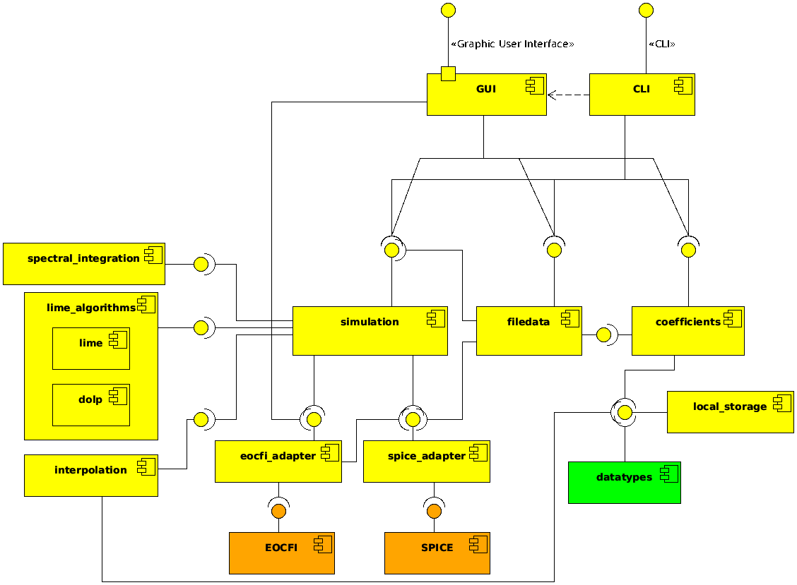

# LIME Toolbox

[](https://gitlab.npl.co.uk/eco/eo/lime_tbx/-/tags) [](https://www.gnu.org/licenses/lgpl-3.0)
[![Issues][issues-shield]][issues-url]
[![Stargazers][stars-shield]][stars-url]
<!--[![LGPL v3 License][license-shield]][license-url]-->


<!-- PROJECT LOGO -->
<br />
<div align="center">
  <a href="https://lime.uva.es">
    
  </a>

  <h3 align="center">lime_tbx</h3>

  <p align="center">
    Run the LIME model, simulate lunar observations and compare them with real remote sensing data.
    <br />
    <a href="https://eco.gitlab-docs.npl.co.uk/eo/lime_tbx/"><strong>Explore the docs »</strong></a>
    <br />
    <br />
    <!--<a href="https://github.com/LIME-ESA/lime_tbx">View Demo</a>
    ·-->
    <a href="https://github.com/LIME-ESA/lime_tbx/issues/new?labels=bug&template=bug-report---.md">Report Bug</a>
    ·
    <a href="https://github.com/LIME-ESA/lime_tbx/issues/new?labels=enhancement&template=feature-request---.md">Request Feature</a>
  </p>
</div>


<!-- TABLE OF CONTENTS -->
<details>
  <summary>Table of Contents</summary>
  <ol>
    <li>
      <a href="#about-the-project">About The Project</a>
      <ul>
        <li><a href="#built-with">Built With</a></li>
      </ul>
    </li>
    <li>
      <a href="#getting-started">Getting Started</a>
      <ul>
        <li><a href="#prerequisites">Prerequisites</a></li>
        <li><a href="#installation">Installation</a></li>
      </ul>
    </li>
    <li><a href="#usage">Usage</a></li>
    <li><a href="#roadmap">Roadmap</a></li>
    <li>
      <a href="#development-guide">Development Guide</a>
      <ul>
        <li><a href="#1-setting-up-the-environment">1. Setting Up the Environment</a></li>
        <li><a href="#2-project-structure">2. Project Structure</a></li>
        <li><a href="#3-testing">3. Testing</a></li>
        <li><a href="#4-deployment">4. Deployment</a></li>
      </ul>
    </li>
    <li><a href="#license">License</a></li>
    <li><a href="#authors">Authors</a></li>
  </ol>
</details>


## About the project

<div align="center">
    <a href="https://github.com/LIME-ESA/lime_tbx">
        
    </a>
</div>

The *lime_tbx* is a Python package that provides a comprehensive toolbox
for utilizing the Lunar Irradiance Model of ESA (LIME) to simulate lunar
observations and compare them with remote sensing data of the Moon.

LIME is the Lunar Irradiance Model of the European Space Agency (ESA),
which aims to determine an improved lunar irradiance model with sub-2%
radiometric uncertainty.

This project is managed, financed and supported by the European Space
Agency (ESA).
  
More information about LIME can be found on [lime.uva.es](https://lime.uva.es).

### Built with

* [](https://www.python.org/)
* [](https://www.qt.io/)
* [](https://naif.jpl.nasa.gov/naif/)
* [![EOCFI][eocfi-badge]](https://eop-cfi.esa.int/index.php/mission-cfi-software/eocfi-software)
* [![CoMet Toolkit][comet-toolkit-badge]](https://www.comet-toolkit.org/)

## Getting started

The LIME Toolbox is designed as an standalone desktop application that one
can directly install without the need of installing Python or any other kind
of software used in its development.

### Prerequisites

The LIME Toolbox is compatible with the following operating systems and architectures:
- Windows 10 with x86_64 arch.
- Linux with GLIBC >= 2.23 and x86_64 arch.
- Mac with x86_64 arch. or with ARM64 arch. and Rosetta interpreter.

### Installation

One can download and install LIME TBX as a standalone desktop application
on [lime.uva.es/downloads](https://lime.uva.es/downloads/).

Another option is installing the python package and its dependencies
by using:
```sh
pip install -e .
```

## Usage

Download the [User Guide](https://calvalportal.ceos.org/documents/10136/964157/DA10_user_guide_v0.docx/b4724686-d758-5625-c1f4-9498c9b69c0d?version=1.0&t=1708947381404&download=true) to fully explore the capabilities of the toolbox.

<!-- TODO: Add usage examples -->

## Roadmap

- [ ] Toolbox compilation through Docker
    - [x] Linux
    - [ ] Windows
    - [ ] Mac
- [ ] Allow coefficients of more than six wavelengths, being as flexible as possible. (**NFR107**)
    - [x] The TBX must accept coefficients that also include data for the 1088 CIMEL photometer's 2130 nm band. (**NFR107-A**)
    - [ ] The TBX must accept coefficients made for any response function specified in the coefficients file. (**NFR107-B**)
- [ ] Improve the speed of uncertainties calculation. (**NFR306**)
- [ ] Fully migrate project to GitHub (issues, CI pipeline, etc.)
- [ ] Allow users to simulate series of lunar observations, where not only the time varies. (**FR107**)


See the [open issues](https://github.com/LIME-ESA/lime_tbx/issues) for a full list of proposed features (and known issues).


## Development Guide

If you wish to contribute to the **lime_tbx** project, please check the [Contributing Guide](./CONTRIBUTING.md).


### 1. Setting Up the Environment

To prepare your development environment, follow these steps:

1. **Install Pre-commit Hooks**  
Install the pre-commit hooks to automatically check code styling:
```sh
pre-commit install  
```

- When you commit changes, `black` will check your code for styling errors.
- If errors are found, they will be corrected, and the commit will be aborted to allow you to review the changes.
- If you're satisfied, reattempt the commit.

2. **Install Python Dependencies**  
Install the python package dependencies, preferably in a python virtual enironment:
```sh
pip install -r requirements.txt  
```

---

### 2. Project Structure

The structure of the **lime_tbx** Python package is visualized in the simplified composite structure diagram:

<div align="center">
<a href="./quality_documentation/uml/composite_simple.png">
  
</a>
</div>

Refer to `quality_documentation/uml/composite_structure.png` for details about the organization of the
components of the python package.

---

### 3. Testing

Run the following commands to ensure the code works as expected:

1. **Unit Tests**  
To perform unit tests:
```sh
python3 -m unittest  
```

2. **Coverage Tests**  
To generate a coverage report:
```sh
./coverage_run.sh  
```

---

### 4. Deployment


Deployed with:

* [](https://www.docker.com)
* [![PyInstaller][pyinstaller-badge]](https://pyinstaller.org/)
* [![InnoSetup][innosetup-badge]](https://jrsoftware.org/isinfo.php)

The desktop app can be deployed automatically or manually.
The first step of the deployment process is compiling the C code
that accesses the EOCFI library. This step is not automated for some
platforms like Windows. After that, one has to build the app bundle
and create the installer, which is can be completely automated through Docker.

#### Automatic deployment (Recommended)

This process is automated through the usage of Docker, so
the it first requires to build the docker image at least once,
and then to run it each time one wants to deploy the app.

##### Linux

To build the image:
```sh
cd deployment
docker build .. -t lime_compiler -f Linux.Dockerfile
```

To run the container and deploy the app:
```sh
docker run -v $(dirname $(pwd)):/usr/src/app/repo lime_compiler
```

##### Windows

Windows automatic deployment doesn't perform the EOCFI C code compilation step.
If one wishes to perform this step, please refer to the manual deployment section, step 1.

To build the image:
```sh
docker build . -t lime_compiler -f Windows.Dockerfile
```

To run the container and deploy the app:
```sh
for %F in ("%cd%") do set dirname=%~dpF
docker run -v %dirname%:C:\repo lime_compiler
```

##### Mac

The Mac automatic deployment is not available yet.

#### Manual deployment

Follow these steps to manually create a production-ready build for your machine:

##### Requirements:
- Python 3.8 (Linux) or Python 3.9 (Mac and Windows).
- `pyinstaller` installed outside of the virtual environment.

<details>
  <summary>Show steps</summary>

1. **Compile C code for EOCFI**

This step compiles the EOCFI C code and generates a binary that will be called
from the toolbox. This isn't necessary unless the C source code has been modified
or the former binary doesn't work for one's system.

In Linux or Mac:
```sh
cd lime_tbx\eocfi_adapter\eocfi_c
cp MakefileLinux Makefile # Linux
cp MakefileDarwin Makefile # Mac
make
```

In Windows:
```dos
cd lime_tbx\eocfi_adapter\eocfi_c
copy make.mak Makefile
nmake
```

2. **Create a Virtual Environment**  
It's strongly recommended to use a virtual environment (venv) to minimize application size:

```sh
python -m venv .venv
source .venv/bin/activate  # For Linux/Mac  
.venv\Scripts\activate     # For Windows  
pip install -r requirements.txt  
```

3. **Build the App Bundle**  
Use `pyinstaller` to create a desktop app-bundle for your OS:
```sh
pyinstaller lime_tbx.spec  
```

Deactivate the virtual environment when the build is complete.

4. **Create an Installer**  
Use the appropriate method for your operating system:
- **Windows**: Use "InnoSetup" and run `inno_installer_builder.iss`.
- **Mac**: Execute `build_mac_installer.sh`.
- **Linux**: Execute `build_linux_installer.sh`.
- **Debian**: Execute `build_deb.sh` after creating the Linux installer.

</details>

#### Additional Information:
For more details on recommended environments for building TBX binaries, check the `installer` directory.


## License

Distributed under the LGPL-v3 License. See [LGPL v3](./LICENSE) for more information.


## Authors

* [Javier Gatón Herguedas](gaton@goa.uva.es) - [GOA-UVa](https://goa.uva.es)
* [Pieter De Vis](pieter.de.vis@npl.co.uk) - [NPL](https://npl.co.uk)
* [Stefan Adriaensen](stefan.adriaensen@vito.be) - [VITO](https://vito.be)
* [Jacob Fahy](jacob.fahy@npl.co.uk) - [NPL](https://npl.co.uk)
* [Ramiro González Catón](ramiro@goa.uva.es) - [GOA-UVa](https://goa.uva.es)
* [Carlos Toledano](toledano@goa.uva.es) - [GOA-UVa](https://goa.uva.es)
* [África Barreto](abarretov@aemet.es) - [AEMET](https://aemet.es)
* [Agnieszka Bialek](agnieszka.bialek@npl.co.uk) - [NPL](https://npl.co.uk)
* [Marc Bouvet](marc.bouvet@esa.int) - [ESA](https://esa.int)

---

<style>
.horizontal-align-container {
  display: flex;
  align-items: center; /* Centers the images vertically */
  justify-content: center; /* Centers the images horizontally */
  background-color: #ffffff; /* Your specified background color */
  padding: 10px;
}
.horizontal-align-container a {
  max-height: 100%; /* Ensures images fit within the container height */
  max-width: 22%; /* Optional: Limits the maximum width of each image */
  margin: 0 1.5%; /* Adds spacing between images */
}
</style>
<div align="center" class="horizontal-align-container">
<a href="https://esa.int"></a> <a href="https://uva.es"></a> <a href="https://npl.co.uk"></a> <a href="https://vito.be"></a>
</div>


[stars-shield]: https://img.shields.io/github/stars/LIME-ESA/lime_tbx.svg?style=for-the-badge
[stars-url]: https://github.com/LIME-ESA/lime_tbx/stargazers
[issues-shield]: https://img.shields.io/github/issues/LIME-ESA/lime_tbx.svg?style=for-the-badge
[issues-url]: https://github.com/LIME-ESA/lime_tbx/issues
[license-shield]: https://img.shields.io/github/license/LIME-ESA/lime_tbx.svg?style=for-the-badge
[license-url]: https://github.com/LIME-ESA/lime_tbx/blob/master/LICENSE.txt

[eocfi-badge]: https://img.shields.io/badge/eocfi-e8e8e4?style=for-the-badge&logo=data:image/svg%2bxml;base64,PD94bWwgdmVyc2lvbj0iMS4wIiBlbmNvZGluZz0iVVRGLTgiIHN0YW5kYWxvbmU9Im5vIj8+DQo8IS0tIENyZWF0ZWQgd2l0aCBJbmtzY2FwZSAoaHR0cDovL3d3dy5pbmtzY2FwZS5vcmcvKSAtLT4NCjxzdmcgeG1sbnM6c3ZnPSJodHRwOi8vd3d3LnczLm9yZy8yMDAwL3N2ZyIgeG1sbnM9Imh0dHA6Ly93d3cudzMub3JnLzIwMDAvc3ZnIiB2ZXJzaW9uPSIxLjAiIHdpZHRoPSIyNDIuODg2MDYiIGhlaWdodD0iMjQyLjk3NTEzIiBpZD0ic3ZnMjQyOSI+DQogIDxkZWZzIGlkPSJkZWZzMjQzMSIvPg0KICA8ZyB0cmFuc2Zvcm09InRyYW5zbGF0ZSgtMjg0LjM0NTI5LC0zMTAuODc0NjIpIiBpZD0ibGF5ZXIxIj4NCiAgICA8cGF0aCBkPSJNIDQ0MS4yNzY1Niw0MjEuNjkwOTEgTCA0ODkuMDY4NTEsNDIxLjY5MDkxIEMgNDg5LjA2ODUxLDQyMS42OTA5MSA0OTAuOTU5NDIsNDE0LjUwNjQ3IDQ4Mi40NDgsNDAzLjczNTU2IEMgNDY1LjYzNTc4LDM4Ni4zNjI0NSA0NDYuNzUwOTYsMzk3Ljg4NDI1IDQ0Ni43NTA5NiwzOTcuODg0MjUgQyA0MzcuNDkwOTcsNDAyLjc5NDY2IDQyNS41OTgyNyw0MjMuMTk5NTEgNDMyLjU3NTIsNDUyLjQ4MDU3IEMgNDQxLjI3NjU2LDQ4MS43Njc3NyA0NzQuNzA4MDIsNDg3Ljc5NDQ0IDQ5NS40ODA3LDQ4MC45OTU5IEMgNTA5LjIyOTM1LDQ3Ni40OTgxNSA1MTcuMTU2MjgsNDY2LjU4MjU4IDUyMC45NzA4Miw0NjAuMzYyNjQgQyA1MjIuMTk3NDksNDU1LjMzMDYyIDUyMy4wNzMwMiw0NTAuMjk4NTQgNTIzLjYyNDc5LDQ0NS4yOTYxMyBMIDQ0MS4yNzY1Niw0NDUuMjk2MTMgTCA0NDEuMjc2NTYsNDIxLjY5MDkxIHoiIGlkPSJwYXRoMjQyNSIgc3R5bGU9ImZpbGw6IzAwMzI0NztmaWxsLW9wYWNpdHk6MTtmaWxsLXJ1bGU6bm9uemVybztzdHJva2U6bm9uZSIvPg0KICAgIDxwYXRoIHN0eWxlPSJmaWxsOiMwMDMyNDc7ZmlsbC1vcGFjaXR5OjE7ZmlsbC1ydWxlOm5vbnplcm87c3Ryb2tlOm5vbmUiIGlkPSJwYXRoMjQyMyIgZD0iTSAzOTkuNTAzMTMsMzE0LjA0ODQgQyAzNDkuMDcxNDQsMzE2LjczMDg4IDMwNC4wNzc5MiwzNTEuNjMzNjEgMjkxLjAxMTIzLDQwMy4xNTk5NiBDIDI3NC45MjMyNiw0NjYuNTgyMjggMzEzLjI4NjI0LDUzMS4wOTE1NCAzNzYuNzAyNzMsNTQ3LjE4MjQ4IEMgNDIxLjc2MDE1LDU1OC42MTIzIDQ2Ny40NDk4NCw1NDIuNTYwMDggNDk1LjgzNDgyLDUwOS41NjE4MyBDIDQ4My4zNTM4Nyw1MTIuNTQ1NDYgNDY4Ljc0NzIxLDUxMi43NDQ0IDQ1Mi44OTQwNiw1MDcuMjgxNzkgQyAzOTkuODAzMzYsNDg4Ljk0OTQxIDM5MC4wNzQ0LDQzOS44MTkxNyA0MDMuMzAzMTksNDA1LjQ0IEMgNDE2LjUxNDUzLDM3MS4wNTg1MiA0NjIuNzc0MjMsMzU1LjAzMjg4IDQ5NC44ODQ4LDM3OC4wNzk1MiBDIDUyMi40MDY1OCwzOTcuODE3ODYgNTIzLjkxODQ2LDQzMi45ODUyNSA1MjMuNzY1Myw0NDIuNjgwNjUgQyA1MjguODMwMDksMzg1Ljc4NjQyIDQ5Mi4xNzg4NSwzMzEuOTc2OTkgNDM1LjAzMzc0LDMxNy40Njg0NiBDIDQyMy4xNDMyNCwzMTQuNDUzMDkgNDExLjE0MTI0LDMxMy40MjkzOSAzOTkuNTAzMTMsMzE0LjA0ODQgeiBNIDM0MS43NDIxMSw0MTguNTUwMjMgQyAzNTAuMTYxNjYsNDE4LjU1MDIzIDM1Ni45NDIzOCw0MjUuMzM2MzUgMzU2Ljk0MjM4LDQzMy43NTA1IEMgMzU2Ljk0MjM4LDQ0Mi4xNjk5MiAzNTAuMTYxNjYsNDQ4Ljk1MDc2IDM0MS43NDIxMSw0NDguOTUwNzYgQyAzMzMuMzI4NTksNDQ4Ljk1MDc2IDMyNi4zNTE4NCw0NDIuMTY5OTIgMzI2LjM1MTg0LDQzMy43NTA1IEMgMzI2LjM1MTkxLDQyNS4zMzYzNSAzMzMuMzI4NTksNDE4LjU1MDIzIDM0MS43NDIxMSw0MTguNTUwMjMgeiIvPg0KICA8L2c+DQo8L3N2Zz4=
[comet-toolkit-badge]: https://img.shields.io/badge/comet_toolkit-003f7f?style=for-the-badge&logo=data:image/png%2bxml;base64,iVBORw0KGgoAAAANSUhEUgAAACAAAAAgCAYAAABzenr0AAAAxHpUWHRSYXcgcHJvZmlsZSB0eXBlIGV4aWYAAHjabVBBEsMgCLz7ij4BgSg+x7TpTH/Q53cNJBPb7owrsMyKpO39eqbbAGdNulQrrRQCtGnjjsDI0XfOpDvv4JCQT/V0CoyS4BZPrUT/Uc+ngV8d0XIxsnsI6yw0DX/7MoqXZUw04kcYtTASdiGHQfdvUWlWr19YN5phftIgtXnsn7xie48F7wjzJlkILFJ8ABlHk3QIDCapaMxoGLGBWWqYYSH/9nQgfQDZtFkRI8BCggAAAYRpQ0NQSUNDIHByb2ZpbGUAAHicfZE9SMNAHMVfU6WiFQc7iDhkqE52URHBpVahCBVCrdCqg8mlX9CkIUlxcRRcCw5+LFYdXJx1dXAVBMEPEGcHJ0UXKfF/SaFFjAfH/Xh373H3DhAaFaZZXXFA020znUyI2dyqGHpFGCH0YRYxmVnGnCSl4Du+7hHg612MZ/mf+3P0q3mLAQGROM4M0ybeIJ7etA3O+8QRVpJV4nPicZMuSPzIdcXjN85FlwWeGTEz6XniCLFY7GClg1nJ1IiniKOqplO+kPVY5bzFWavUWOue/IXhvL6yzHWaI0hiEUuQIEJBDWVUYCNGq06KhTTtJ3z8w65fIpdCrjIYORZQhQbZ9YP/we9urcLkhJcUTgDdL47zMQqEdoFm3XG+jx2neQIEn4Erve2vNoCZT9LrbS16BAxsAxfXbU3ZAy53gKEnQzZlVwrSFAoF4P2MvikHDN4CvWteb619nD4AGeoqdQMcHAJjRcpe93l3T2dv/55p9fcD7EVy1xFajRMAAA14aVRYdFhNTDpjb20uYWRvYmUueG1wAAAAAAA8P3hwYWNrZXQgYmVnaW49Iu+7vyIgaWQ9Ilc1TTBNcENlaGlIenJlU3pOVGN6a2M5ZCI/Pgo8eDp4bXBtZXRhIHhtbG5zOng9ImFkb2JlOm5zOm1ldGEvIiB4OnhtcHRrPSJYTVAgQ29yZSA0LjQuMC1FeGl2MiI+CiA8cmRmOlJERiB4bWxuczpyZGY9Imh0dHA6Ly93d3cudzMub3JnLzE5OTkvMDIvMjItcmRmLXN5bnRheC1ucyMiPgogIDxyZGY6RGVzY3JpcHRpb24gcmRmOmFib3V0PSIiCiAgICB4bWxuczp4bXBNTT0iaHR0cDovL25zLmFkb2JlLmNvbS94YXAvMS4wL21tLyIKICAgIHhtbG5zOnN0RXZ0PSJodHRwOi8vbnMuYWRvYmUuY29tL3hhcC8xLjAvc1R5cGUvUmVzb3VyY2VFdmVudCMiCiAgICB4bWxuczpkYz0iaHR0cDovL3B1cmwub3JnL2RjL2VsZW1lbnRzLzEuMS8iCiAgICB4bWxuczpHSU1QPSJodHRwOi8vd3d3LmdpbXAub3JnL3htcC8iCiAgICB4bWxuczp0aWZmPSJodHRwOi8vbnMuYWRvYmUuY29tL3RpZmYvMS4wLyIKICAgIHhtbG5zOnhtcD0iaHR0cDovL25zLmFkb2JlLmNvbS94YXAvMS4wLyIKICAgeG1wTU06RG9jdW1lbnRJRD0iZ2ltcDpkb2NpZDpnaW1wOjk0MzI1NGNjLWZmNzMtNGU4Yy1iYTVjLWIzZDk0ODYyYjYxOSIKICAgeG1wTU06SW5zdGFuY2VJRD0ieG1wLmlpZDpkNjgzNDE0YS04MzY5LTRkYTEtOTJmYi0xNzEzYzA1YmNkOWEiCiAgIHhtcE1NOk9yaWdpbmFsRG9jdW1lbnRJRD0ieG1wLmRpZDowODljYjcyNy00NDgxLTQ1MzItOGZhMy1mNTczZDg2ZDgwOWQiCiAgIGRjOkZvcm1hdD0iaW1hZ2UvcG5nIgogICBHSU1QOkFQST0iMi4wIgogICBHSU1QOlBsYXRmb3JtPSJMaW51eCIKICAgR0lNUDpUaW1lU3RhbXA9IjE3MzM1NzMzMDgwNTY1MjMiCiAgIEdJTVA6VmVyc2lvbj0iMi4xMC4zNiIKICAgdGlmZjpPcmllbnRhdGlvbj0iMSIKICAgeG1wOkNyZWF0b3JUb29sPSJHSU1QIDIuMTAiCiAgIHhtcDpNZXRhZGF0YURhdGU9IjIwMjQ6MTI6MDdUMTM6MDg6MjcrMDE6MDAiCiAgIHhtcDpNb2RpZnlEYXRlPSIyMDI0OjEyOjA3VDEzOjA4OjI3KzAxOjAwIj4KICAgPHhtcE1NOkhpc3Rvcnk+CiAgICA8cmRmOlNlcT4KICAgICA8cmRmOmxpCiAgICAgIHN0RXZ0OmFjdGlvbj0ic2F2ZWQiCiAgICAgIHN0RXZ0OmNoYW5nZWQ9Ii8iCiAgICAgIHN0RXZ0Omluc3RhbmNlSUQ9InhtcC5paWQ6ZjhmZDI4YWItYzc4Yi00NWQ5LTgyNjEtMDMyZDg5MzlkNjE4IgogICAgICBzdEV2dDpzb2Z0d2FyZUFnZW50PSJHaW1wIDIuMTAgKExpbnV4KSIKICAgICAgc3RFdnQ6d2hlbj0iMjAyNC0xMi0wN1QxMzowODoyOCswMTowMCIvPgogICAgPC9yZGY6U2VxPgogICA8L3htcE1NOkhpc3Rvcnk+CiAgPC9yZGY6RGVzY3JpcHRpb24+CiA8L3JkZjpSREY+CjwveDp4bXBtZXRhPgogICAgICAgICAgICAgICAgICAgICAgICAgICAgICAgICAgICAgICAgICAgICAgICAgICAgICAgICAgICAgICAgICAgICAgICAgICAgICAgICAgICAgICAgICAgICAgICAgICAgCiAgICAgICAgICAgICAgICAgICAgICAgICAgICAgICAgICAgICAgICAgICAgICAgICAgICAgICAgICAgICAgICAgICAgICAgICAgICAgICAgICAgICAgICAgICAgICAgICAgICAKICAgICAgICAgICAgICAgICAgICAgICAgICAgICAgICAgICAgICAgICAgICAgICAgICAgICAgICAgICAgICAgICAgICAgICAgICAgICAgICAgICAgICAgICAgICAgICAgICAgIAogICAgICAgICAgICAgICAgICAgICAgICAgICAgICAgICAgICAgICAgICAgICAgICAgICAgICAgICAgICAgICAgICAgICAgICAgICAgICAgICAgICAgICAgICAgICAgICAgICAgCiAgICAgICAgICAgICAgICAgICAgICAgICAgICAgICAgICAgICAgICAgICAgICAgICAgICAgICAgICAgICAgICAgICAgICAgICAgICAgICAgICAgICAgICAgICAgICAgICAgICAKICAgICAgICAgICAgICAgICAgICAgICAgICAgICAgICAgICAgICAgICAgICAgICAgICAgICAgICAgICAgICAgICAgICAgICAgICAgICAgICAgICAgICAgICAgICAgICAgICAgIAogICAgICAgICAgICAgICAgICAgICAgICAgICAgICAgICAgICAgICAgICAgICAgICAgICAgICAgICAgICAgICAgICAgICAgICAgICAgICAgICAgICAgICAgICAgICAgICAgICAgCiAgICAgICAgICAgICAgICAgICAgICAgICAgICAgICAgICAgICAgICAgICAgICAgICAgICAgICAgICAgICAgICAgICAgICAgICAgICAgICAgICAgICAgICAgICAgICAgICAgICAKICAgICAgICAgICAgICAgICAgICAgICAgICAgICAgICAgICAgICAgICAgICAgICAgICAgICAgICAgICAgICAgICAgICAgICAgICAgICAgICAgICAgICAgICAgICAgICAgICAgIAogICAgICAgICAgICAgICAgICAgICAgICAgICAgICAgICAgICAgICAgICAgICAgICAgICAgICAgICAgICAgICAgICAgICAgICAgICAgICAgICAgICAgICAgICAgICAgICAgICAgCiAgICAgICAgICAgICAgICAgICAgICAgICAgICAgICAgICAgICAgICAgICAgICAgICAgICAgICAgICAgICAgICAgICAgICAgICAgICAgICAgICAgICAgICAgICAgICAgICAgICAKICAgICAgICAgICAgICAgICAgICAgICAgICAgICAgICAgICAgICAgICAgICAgICAgICAgICAgICAgICAgICAgICAgICAgICAgICAgICAgICAgICAgICAgICAgICAgICAgICAgIAogICAgICAgICAgICAgICAgICAgICAgICAgICAgICAgICAgICAgICAgICAgICAgICAgICAgICAgICAgICAgICAgICAgICAgICAgICAgICAgICAgICAgICAgICAgICAgICAgICAgCiAgICAgICAgICAgICAgICAgICAgICAgICAgICAgICAgICAgICAgICAgICAgICAgICAgICAgICAgICAgICAgICAgICAgICAgICAgICAgICAgICAgICAgICAgICAgICAgICAgICAKICAgICAgICAgICAgICAgICAgICAgICAgICAgICAgICAgICAgICAgICAgICAgICAgICAgICAgICAgICAgICAgICAgICAgICAgICAgICAgICAgICAgICAgICAgICAgICAgICAgIAogICAgICAgICAgICAgICAgICAgICAgICAgICAgICAgICAgICAgICAgICAgICAgICAgICAgICAgICAgICAgICAgICAgICAgICAgICAgICAgICAgICAgICAgICAgICAgICAgICAgCiAgICAgICAgICAgICAgICAgICAgICAgICAgICAgICAgICAgICAgICAgICAgICAgICAgICAgICAgICAgICAgICAgICAgICAgICAgICAgICAgICAgICAgICAgICAgICAgICAgICAKICAgICAgICAgICAgICAgICAgICAgICAgICAgICAgICAgICAgICAgICAgICAgICAgICAgICAgICAgICAgICAgICAgICAgICAgICAgICAgICAgICAgICAgICAgICAgICAgICAgIAogICAgICAgICAgICAgICAgICAgICAgICAgICAgICAgICAgICAgICAgICAgICAgICAgICAgICAgICAgICAgICAgICAgICAgICAgICAgICAgICAgICAgICAgICAgICAgICAgICAgCiAgICAgICAgICAgICAgICAgICAgICAgICAgICAgICAgICAgICAgICAgICAgICAgICAgICAgICAgICAgICAgICAgICAgICAgICAgICAgICAgICAgICAgICAgICAgICAgICAgICAKICAgICAgICAgICAgICAgICAgICAgICAgICAgCjw/eHBhY2tldCBlbmQ9InciPz5GcUvFAAAABmJLR0QA/wD/AP+gvaeTAAAACXBIWXMAAAsTAAALEwEAmpwYAAAAB3RJTUUH6AwHDAgcuybJ1AAABF9JREFUWMPtl81vFHUYx7+/ndl32lJKW1BqRHmJGEUQ5KoHb8aLrwdOXozxZPwPPHCUxMR4Ix6IJpqYWC8kYKAWo6VAEFJqWt660O1u6Xa3+zI7OzszHw+7y0vEYKFYE32SyUxmnl9+3+f7vPy+I/1v/3kD1qzm/hFJ/XDqQ1jYt8pMDAO/sZqpMPAzXDsEuB/f/S3/Diy++Y/UA5yHU4fAPw/wUft9HC6BPwrw6qMGkYQZvDPfwNVjcPMI0JgADsMM7uQwcBFoHFiJ/cxfgBhSfSyjrCN196pQLiuR7lF6/YBfy5dsq+kq5i8qMtQrxXdPSHpX0lVJmyUVjTGzy+mCe1lOyX1fK4oc31bf03vUSA1oLu/YTrRLJXWLvufkF7vUmBp5VsWRC1KxKmm/dOMG3DwLrHuINFR3AW8AlKdGWJi7DIALLDplsnOzLGTnaZbK4LvUshPUZ8ehMeUC31E6B9d/AhgDhoDYMlNQHpSmT0q7HanwfD5TUhjrUu+GAUWEYjJamK9oTSqtRNxIthFNT269olIh19jY3xtvFIqKB0vSY1Epufe0pNeMMfm/WwMRqdil3K859exK1Cq2ymEgWWhj/+CflwbtZBqp7tXUbLpq1KpKGynVk5ZyU9ITT0jatN0YM3VfAHcV49SJKxV70K7bCYWJpOyYpbVr+yRFWgXkSxG75e82AiXillx5smSpUi4rZSWVSCek4qTUiyPt6DfGOMubDRNHIH8N3AbZ2XlKDgB4QetO2L7a1gjcW8/OHe/xZiA8C/AMYN2XgdsgSoOaPnNZfdvTWve4/FDyQillS54vxezbvlXH0ZpUSvKrCus1RaKWwoariGVJcSP5FSkZDaQndxpjJpbBRC7NpWNNljK3wq0T0iGhWS9D4LUI8ZvALFAFqADZllcGwutQuwAsAAwssz1zm93JYWjOAS4BUIM2iADCRodrgDngM+B1YCfwIvABAJUzUB8HOPwgo/rt0uSwF3oF6kC9HWLYAVHPANwERtv+Y8A00N9ZD/OQHwPgQc+LjWE5U24EHmEbRDkA3CXAB5iCswBfwig0vwd4AYqfAC8DRbxL0Or35W5+4nMVRo+aqOlaunFFfrWghKR4RPIDV5JVk8rdck9L0nHppR9k7zsnyZHMe5Lel3RQ0R5J1QeK3oJzAb8fhdoczfkMvlvDB7za9c7EPg7Nq8C29pq3wD/J2AGofgXwBcwDwfIZMMYE0s512r51QfMZ2f1DilhJSZJl+0heXNKIMdHNnalnjPlWsooa7JHSCUmaVJiVFCk/jG7YAtlPmRlvgkOASyuqaYDz9/DvavUhrwCweDRcEUEMta2UfrmGt9juwFJn7h28B4hR4AJLP3Z8ulZKRW2C2WN+/mKdxgLUptvBMg7sb+lNtkAVFocBJw88BRizQgAsSaGkbdLFETm1btXdpCykGFIqISHJuJL2ulJqgzFm6VHqyj1A7o5jKAR2tPQm61dT+sf+db+GfwDCAA2LcTQu5gAAAABJRU5ErkJggg==
[innosetup-badge]: https://img.shields.io/badge/inno_setup-005799?style=for-the-badge&logo=data:image/png%2bxml;base64,AAABAAEAEBAAAAEAIABoBAAAFgAAACgAAAAQAAAAIAAAAAEAIAAAAAAAQAQAAAAAAAAAAAAAAAAAAAAAAAAAAAAAAAAAAAAAAAAAAAAJAAAADwAAAA8AAAAMAAAADAAAABEAAAASAAAAEAAAAAkAAAABAAAAAAAAAAAAAAAAAAAAACMYAQg5KQpvX08uomNTM6dJORiMLRoAiDEaALUyGwDCLhkAqiYUAHAJBQAjAAAAFwAAAAcAAAAAAAAAACIXAQd8bU3N9PDl///9+f///fr///z3/+fh1P+lmH7/W0Uc/0wvAP9FKQD/Nx4A6SQTAF8AAAAZAAAACQAAAAAyIgJS8evf///+/v///v7///77///9+////v3///7+//v48f+wo4n/WT8P/1EzAP8+JAD9LRwBawAAABgAAAAHNSQEYPz47////vz/xLSS/598N/+lfi//tpZT/9C9l//49On///78/+vm2f91YTn/TTEA/56Obfk0JgpbAAAAGC4fAibQxrL+8OnZ/5lhAP+/fQD/yYYA/8yHAP/FgwD/sXoN/8ercP/48+f/+/jx/4BvTv/Z0Lv/xbuk+SYaAkwAAAAAkXY/svrx2/+/gAj/35YE/+WdD//moBP/5JwN/92UAv/MhwD/rnwW/9vLqf/7+PH/8/Dq///89f8tIARvAAAAAH9GAF3bu33/5bpj/+uuNv/tuE7/7rtV/+22Sv/qqy//2pUM/86hRP/Ao2f/9fDl/////////Pb/LSAEbwAAAACMQwBc1IEM//HXn//vzIT/89CJ//TTkv/zzoX/78Fk/+uuNv/doSb/+O3U///+/f///v7///vz/y4gBG4AAAAAi0UAN96IF//tv2v/+OrM//jmwf/56Mb/9+G1//PRjv/uvVr/6KQc/9GXIf/HpmP/rJRk/5GAYfcuHwNXAAAAAGI2AwPZhhvj7bxn//fgs//89+z//fju//ru1f/226b/8MRt/+qrLf/ZkAD/snQA/3xKAP89IACjAAAAAwAAAAAAAAAAyX0bZ+qxV//12ab/+/Hc//358P/67tb/9tun//DFbv/qqy3/140A/6loAP9rOgD2MRgAKgAAAAAAAAAAAAAAAGNCEwHZmDml78N5//besP/558T/9+G1//PRjv/uu1j/5Z0b/8h5AP+QTgD9WS0AYAAAAAAAAAAAAAAAAAAAAAAAAAAAdFIgA9mdQoXqtmL578R5/+/Cc//rs1X/5Jsq/9R5Bf+lVQDodToATwAAAAAAAAAAAAAAAAAAAAAAAAAAAAAAAAAAAAAAAAAAonIrH9WRMHnajiet1oEWu85rBaGuVABhZjMACwAAAAAAAAAAAAAAAAAAAAAAAAAAAAAAAAAAAAAAAAAAAAAAAAAAAAAAAAAAAAAAAAAAAAAAAAAAAAAAAAAAAAAAAAAAAAAAAAAAAAAAAAAA4AcAAIADAAAAAQAAAAAAAAAAAAAAAAAAgAAAAIAAAACAAAAAgAAAAIAAAADAAQAAwAMAAOAHAAD4DwAA//8AAA==
[pyinstaller-badge]: https://img.shields.io/badge/pyinstaller-3670A0?style=for-the-badge&logo=data:image/png%2bxml;base64,iVBORw0KGgoAAAANSUhEUgAAABAAAAAQCAMAAAAoLQ9TAAAAIGNIUk0AAHomAACAhAAA+gAAAIDoAAB1MAAA6mAAADqYAAAXcJy6UTwAAAKgUExURb29vpubm////6ampgAAAAcHCi8eOTFrDGTQADreATqZIV1ZY2FhaWRka2dnaWtram9vb1dXWFpaWmRkZ2hoaGNqYC22FWGESGVlaWxsa2dnawAAAGhoZmpqaiIiJGJiZm5uaDo6Pl1dZHR0ZUZGTF5eaHl5Yk1NVFZWYZSURn9/XVBQWFFRXYyMToWFWFlZYU9PW4GBVH5+c2JiZE9PU3Z2bWRkZEJCQXV1dWdnZzIyMnJycmxsbBMTE29vb3FxcQAAAGpqaru7u7a2tn19fXJycnNzc2RkZFRUVHFxcXJycnx8fKampqKiop+fn52dnY+Pj4uLi4SEhFVVVTw8PDExMQ0NDV7+ABnHCz+DQJ6cQKurNbe3KsLCIJSUSpmZP8PBI4+7GGPvAy7xAAy3C3eteWqiSL/eAP//ALW1LL29IPfyAJHiAD34ABTfAATLBUSQRCV7KEK3AKbSAO7zAL+/I6urK9vYAIDgAIX6ABPRAADKAAC1AACxAADeACPMAN/sAMvLGqSkM93aAGfhADv8ADXZAA3qAADFABbCAGa0AJJkAObbANfXEpubPdvXAGbdAE/2AFq6AAn2AAD5AETXAPXxAMWgAMe6AODgDdzZAJXaABDvAA63AADrAAD/ACvqAOr0APj5APf3AOnpCM/OAtvlAD3kAAD4ADjoAPL3AP7+AOvrBN3dBfHvAsHYBkTDCQ/TDg7UEGSuGry6IrCwKqSkMqCgQJaWToyMVYqLWISDXn17aHSAc3qIeoeHhI+PkJaWmY2Nknl5fn5+gn5+f4CAg3p6fZycnri3ubu6u769vsDAwMHBwcLCwrCwsHx8fICAgH9/f4GBgXt7e6GhobW1tZqamru7u4SEhH19fZOTk7+/v76+vr29vf///+3mXiUAAABXdFJOUwAAAAABCBEysPi9eZGrxt/yc3eitsnk/prerQTJwAyy0Rea4CWB7Ddt/fRLVvj7YkHw/ngu5pMh3K4UzcYKu90Dqf347dzLn1Xp7ubhzLSaiG5XPCESBtCJW1gAAAABYktHRAJmC3xkAAAAB3RJTUUH6AwGDhQswLAXLgAAARtJREFUGNMBEAHv/gAABAUGBwgJCgsMDQ4PEBEBABITFBUWV1hZF1pbXF1eGAIAGV9gYWJjZGVmZ2hoaGkaGwAcamtsbW5vcHFyc3RodR0eAB92d3h5ent8fX5/gGiBICEAIoKDhIWGh4iJiouMaI0jJAAljo+QkZKTlJWWl5homSYnACgpmpucnZ6foKGio2ikKisALC2lpqeon5+pqmhoq6wuLwAwMa2ur7CxsrO0tba3uDIzADQ1ubq7vL2+v8DBwsPExTYANzjGx8jJysvMzc7P0NHSOQA6O9PU1c7MzMzMzdbS0dE8AD0+0dDXzczMzMzN2NnR0z8AQEHR2tvNzNzd3kJDREVGRwADSElKS0xNTk9QUVJTVFVWls13UDRcyB8AAAAldEVYdGRhdGU6Y3JlYXRlADIwMjQtMTItMDZUMTQ6MjA6NDMrMDA6MDCiB4fnAAAAJXRFWHRkYXRlOm1vZGlmeQAyMDI0LTEyLTA2VDE0OjIwOjQzKzAwOjAw01o/WwAAACh0RVh0ZGF0ZTp0aW1lc3RhbXAAMjAyNC0xMi0wNlQxNDoyMDo0NCswMDowMEHoIAoAAAAASUVORK5CYII=