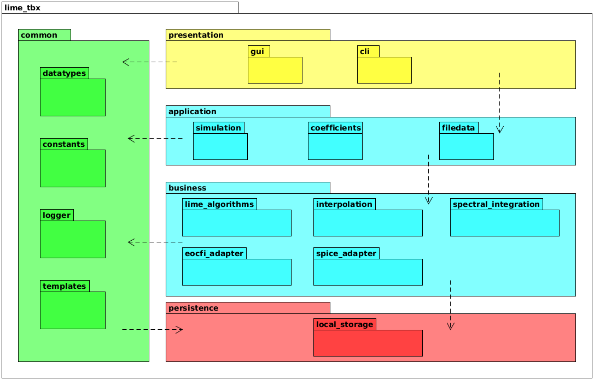

# Design

## Software architecture

All the toolbox features and functionalities are encompassed in the `lime_tbx` Python package.
This package is structured following a layered architecture with four main layers: `presentation`,
`application`, `business` and `persistence`, and a helper one: `common`.

<figure align="center" id="fig-1">
  
  <figcaption><i>Figure 1</i>: lime_tbx package architecture.</figcaption>
</figure>

The architecture is described in UML in [Figure 1](#fig-1). We can observe the following subpackages:
- **lime_tbx/presentation**:
  - **lime_tbx/presentation/gui**:
  - **lime_tbx/presentation/cli**:
- **lime_tbx/application**:
  - **lime_tbx/application/simulation**:
  - **lime_tbx/application/coefficients**:
  - **lime_tbx/application/filedata**:
- **lime_tbx/business**:
  - **lime_tbx/business/lime_algorithms**:
  - **lime_tbx/business/interpolation**:
  - **lime_tbx/business/spectral_integration**:
  - **lime_tbx/business/eocfi_adapter**:
  - **lime_tbx/business/spice_adapter**:
- **lime_tbx/common**:
  - **lime_tbx/common/datatypes**:
  - **lime_tbx/common/constants**:
  - **lime_tbx/common/logger**:
  - **lime_tbx/common/templates**:
- **lime_tbx/persistence**:
  - **lime_tbx/persistence/local_storage**:
