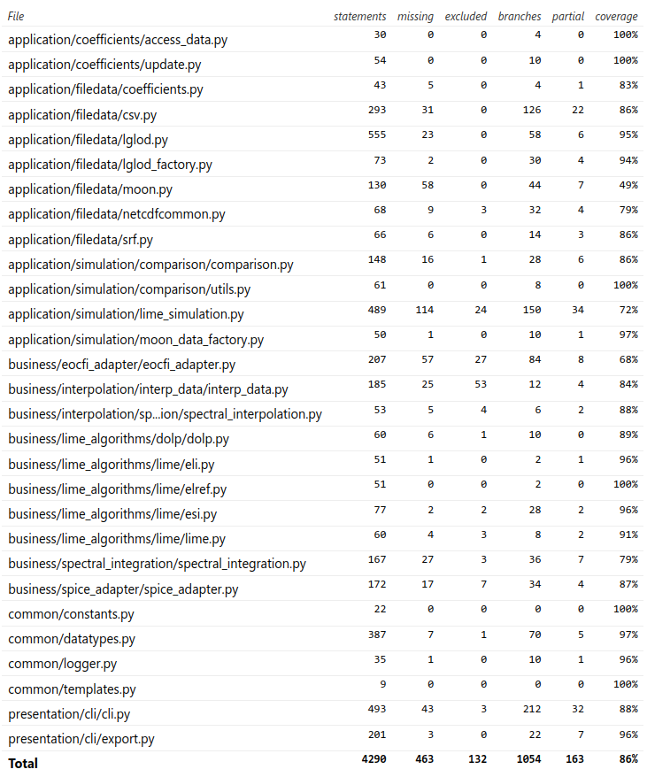

# Implementation

The repository is organized into the following directories:

- **lime_tbx**: The `lime_tbx` Python package containing the LIME Toolbox.
- **test_files**: Data files used in automated tests for `lime_tbx`.
- **coeff_data**: LIME coefficients and related files.
- **eocfi_data**: Ephemerides, geometries and other data used for EO-CFI satellite computations.
- **kernels**: SPICE toolkit kernels.
- **deployment**: Files and scripts needed to perform the deployment process, which generates installers for different operating systems.
- **docs**: Documentation for both users and developers.

## Ancillary Data Files

LIME Toolbox relies on various data files to compute geometries, coordinates, satellite positions, and the LIME model.
Some of these files are stored in the installation directory, while others reside in the *appdata* directory
(see [Configuration and Logging](#configuration-and-logging)).

Files and directories in the installation directory cannot be modified by the toolbox due to restricted write access
without admin privileges, therefore the *appdata* directory is used for files and directories that require modification.
If the toolbox is not installed, it defaults to using the current working directory as both
the installation and the *appdata* directory.

### LIME Coefficient Files

LIME coefficient files are located under the `coeff_data` directory, in the *appdata* directory. This directory contains:
- **coefficients_server.txt**: Text file with the URL where LIME coefficient files can be downloaded.
- **selected.txt**: Text file with the name of the last selected coefficient file, ensuring persistence across sessions.
- **versions/**: Directory containing all downloaded LIME coefficient in netCDF format. The exact format is described in [Table 1](#tab-1).

<center id='tab-1'>

| Variable | Dimensions | dtype |
|:--------:|:-----------|:------|
| coeff | `i_coeff`, `wavelength` | float64 |
| u_coeff | `i_coeff`, `wavelength` | float64 |
| err_corr_coeff | `i_coeff.wavelenth`, `i_coeff.wavelenth` | float32 |
| dolp_coeff_pos | `j_coeff`, `wavelength` | float64 |
| u_dolp_coeff_pos | `j_coeff`, `wavelength` | float64 |
| err_corr_dolp_coeff_pos | `j_coeff.wavelenth`, `j_coeff.wavelenth` | float32 |
| dolp_coeff_neg | `j_coeff`, `wavelength` | float64 |
| u_dolp_coeff_neg | `j_coeff`, `wavelength` | float64 |
| err_corr_dolp_coeff_neg | `j_coeff.wavelenth`, `j_coeff.wavelenth` | float32 |
| wavelength | `wavelength` | integer |

<i>Table 1</i>: LIME coefficients netCDF file format.

</center>

### EO-CFI Data Files

LIME Toolbox uses the EO-CFI libraries to compute satellite positions. These computations require data files
in one of the following formats:
- Orbit Scenario Files (OSF)
- Three-Line Element Set Files (3LE/TLE)
These files are located in the `eocfi_data` directory within the installation directory, which contains two
main elements:
- **esa_sat_list.yml**: A YAML file listing all available satellites and their associated data files.
  Satellites can be defined using OSF or 3LE files, with format details provided in [Table 2](#tab-2).
- **data/**: Subdirectory containing all the referenced OSF and 3LE data files in `esa_sat_list.yml`.

LIME Toolbox allows users to add satellites if they have the necessary data files.
Since installation directories cannot be modified, a separate `eocfi_data` directory is created in *appdata*, following
the same structure.

If a satellite appears in both directories for the same date and time, *appdata* takes priority.

<center id='tab-2'>

| Attribute | Description | OSF/TLE |
|:----------|:------------|:-------:|
| **id** | Satellite ID number (see [EO-CFI GeneralSUM manual][eocfi-generalsum], Section 7.2). | Both |
| **n_files** | Number of orbit files listed. | Both |
| **orbit_files** | List of file paths for each data file. | Both |
| **norad_sat_number** | NORAD satellite catalog number. | TLE |
| **intdes** | International Designator string. | TLE |
| **timefile** | OSF file used for time equivalence calculations. | TLE |

<i>Table 2</i>: `esa_sat_list.yml` satellite attributes.

</center>

### SPICE Kernels

The SPICE toolkit enables LIME Toolbox to compute geometries and coordinates. It requires access to kernel files,
which contain essential data such as geometries, ephemerides, and reference frames.  

These kernel files are stored in the `kernels` directory within the installation directory.

## Configuration and Logging

LIME Toolbox simulations can be customized by the user. For example, the interpolation reference can be
set to **ASD spectra** (preferred) or **Apollo 16 + Breccia**.
Configuration is managed through a YAML configuration file.

The Toolbox also logs error, warning and debug messages into text files within the logging directory.

Both the configuration file and the logging directory are stored in the LIME Toolbox *appdata*
directory, which varies depending on the operating system when the toolbox is installed:
- **Windows**: `%appdata%\LimeTBX\`
- **Linux**: `~/.LimeTBX/`
- **Mac**: `~/Library/Application Support/LimeTBX/`

If the toolbox is not installed, it will default to using the current working directory as the *appdata* location.

### Configuration File

The YAML configuration file defines various attributes for customizing simulations:  

- **interpolation_SRF** (`str`) – Spectral Response Function of the TSIS-1 Hybrid Solar Reference Spectrum.
- **interpolation_spectrum** (`str`) – Spectrum used as the interpolation reference for reflectance.
- **interpolation_spectrum_polarisation** (`str`) – Spectrum used as the interpolation reference for polarization.
  *Note:* This value cannot be modified via the UI yet, as only **Linear** is currently valid.
- **show_cimel_points** (`bool`) – Whether CIMEL anchor points should be plotted (`true`/`false`).
- **show_interp_spectrum** (`bool`) – Whether the interpolation spectrum should be included in the output plot (`true`/`false`).
- **skip_uncertainties** (`bool`) – Whether to skip uncertainty computations (`true`/`false`).
  *Note:* Uncertainty calculations are the primary performance bottleneck in LIME Toolbox simulations, so disabling
  them significantly increases speed.
- **use_wehrli** (`bool`) – Whether to use **TSIS-1 HSRS** (`false`) or **Wehrli** (`true`) as the solar spectrum.
  *Note:* This setting cannot be modified via the UI and it's `false` by default.

This file is loc located in the *appdata* directory, under a directory named `coeff_data`.

### Logging

By default, LIME Toolbox logs at the `INFO` level. To enable `DEBUG` logging, set the environment variable
`LIME_DEBUG` to `DEBUG`.

## Deployment
The deployment process involves compilation, building, and packaging to generate installers for various
operating systems. It is carried out using:

* [](https://www.docker.com)
* [![PyInstaller][pyinstaller-badge]](https://pyinstaller.org/)
* [![InnoSetup][innosetup-badge]](https://jrsoftware.org/isinfo.php)

All required files are under the `deployment` directory, which contains:
- **installer/**: Scripts and configuration files for manually building and packaging installers.
- **automatic/**: Dockerfiles and scripts for automating the build processes carried out in `installer/`.

### Manual Deployment

The `deployment/installer` directory contains scripts and configuration files to build production-ready
installers. These installers are OS and machine-dependent, so it's recommended to use 
automated deployment whenever possible, whioh is explained in Section
[Automated Deployment](#automated-deployment).

#### Requirements:
- Python 3.9.
- `pyinstaller` installed outside of the virtual environment.


#### 1. Compile C code for EO-CFI
This step compiles a small C program with the EO-CFI libraries to generate a binary required by LIME Toolbox.
This is only needed if the C source code has been modified, the EO-CFI libraries have been updated, or the
binary does not work on your system.

In Linux or Mac:
```sh
cd lime_tbx/eocfi_adapter/eocfi_c
cp MakefileLinux Makefile # Linux
cp MakefileDarwin Makefile # Mac
make
```

In Windows:
```dos
cd lime_tbx\eocfi_adapter\eocfi_c
copy make.mak Makefile
nmake
```

#### 2. Create a Virtual Environment
To minimize application size it's strongly recommended to use a virtual environment (`venv`) :

```sh
python -m venv .venv
source .venv/bin/activate  # For Linux/Mac
.venv\Scripts\activate     # For Windows
pip install -r requirements.txt
pip install PySide6~=6.8   # Use PySide2 for older OS versions
```

#### 3. Build the App Bundle
Use `pyinstaller` to create an executable bundle for your OS:
```sh
pyinstaller lime_tbx.spec  
```

Once the build is complete, deactivate the virtual environment.

#### 4. Create an Installer
Navigate to the `deployment/installer` directory and use the appropriate method for your operating system:
- **Windows**: Use "InnoSetup" and run `inno_installer_builder.iss`.
- **Mac**: Run `build_mac_installer.sh`.
- **Linux**: Run `build_linux_installer.sh`.
- **Debian**: Run `build_deb.sh` after building the Linux installer.

### Automated Deployment

The deployment process is automated using Docker. It requires building the Docker image
once, and then running it each time the app is deployed.

#### Linux Automated Deployment

1. Build the image:
    ```sh
    cd deployment/automatic
    docker build ../.. -t lime_compiler -f Linux.Dockerfile
    ```

2. Run the container and deploy the app:
    ```sh
    docker run -v $(dirname $(dirname $(pwd))):/usr/src/app/repo lime_compiler
    ```

#### Windows Automated Deployment

Windows automated deployment is only available via Docker for Windows and does not
include the EO-CFI C code compilation step.
If EO-CFI libraries have been updated, refer
to <a href="#1-compile-c-code-for-eocfi">Manual Deployment - Step 1</a>.

1. Build the image:
    ```sh
    docker build .. -t lime_compiler -f Windows.Dockerfile
    ```

2. Run the container and deploy the app:
    ```sh
    for %F in ("%cd%") do set dirname=%~dpF
    for %F in ("%dirname%") do set grandparent=%~dpF
    docker run -v %grandparent%:C:\repo lime_compiler
    ```

#### Mac Automated Deployment (Unavailable)

Automatic deployment for macOS is currently unavailable. Docker does not support
macOS as a guest OS due to the lack of macOS containers.

Future plans include exploring automated deployment using GitHub Actions with macOS runners.

## Code Quality
[](https://about.gitlab.com/stages-devops-lifecycle/continuous-integration/)
[](https://github.com/features/actions)

Maintaining high code quality is essential for the reliability, maintainability, and performance of the LIME Toolbox.  
To ensure a robust and well-structured codebase, we follow best practices in code formatting, static analysis,
testing, and documentation through an automated Continuous Integration (CI) pipeline.  

Currently, CI is defined in `.gitlab-ci.yml`, running automated checks on every commit.
In the future, this pipeline will be migrated to *GitHub Actions* and defined in `.github/workflows/ci-pipeline.yaml`.

### Code Style and Static Analysis

LIME Toolbox enforces strict code quality standards through automated formatting and static
analysis tools, ensuring consistency and reliability in the codebase.

- [![Black][black-badge]](https://black.readthedocs.io/en/stable/) - Automatically formats code to
  ensure consistency with PEP 8 and PEP 257.
- [![Pylint][pylint-badge]](https://pylint.pycqa.org/en/latest/) - Performs static code analysis to
  enforce best practices and detect potential issues.
- [![my\[py\]][mypy-badge]](https://mypy.readthedocs.io/en/stable/) - Checks type annotations to improve
  code clarity and catch type-related errors early.

These tools run as part of the CI pipeline for every commit to ensure every branch meets our quality
standards before being merged.
Developers are encouraged to run these tools locally before pushing changes to streamline the
development process.

### Testing

The `lime_tbx` package is validated through a suite of 260 unit tests. These tests run automatically
whenever the code changes, ensuring stability and preventing regressions.

LIME Toolbox uses the following tools to manage and execute tests:  
- [![unittest][unittest-badge]](https://docs.python.org/3/library/unittest.html) - The built-in Python
  testing framework used for defining and structuring test cases.
- [![pytest][pytest-badge]](https://docs.pytest.org/en/latest/) - A more powerful test runner that
  provides enhanced test discovery, fixtures, and assertions.
- [![Tox][tox-badge]](https://tox.wiki/en/latest/) - A testing automation tool used to run tests in
  isolated environments, ensuring compatibility across different Python versions.

Currently, testing is executed via GitLab CI Pipelines, with plans to migrate to GitHub CI in the future.  
The current test coverage is approximately 86%, as shown in [Figure 2](#fig-2).  

<figure align="center" id="fig-2">
  
  <figcaption><i>Figure 2</i>: Summary of unit testing code coverage.</figcaption>
</figure>

### Code Documentation

[![Interrogate][interrogate-badge]](https://interrogate.readthedocs.io/en/latest/)

LIME Toolbox follows the *Numpydoc* standard for docstrings, ensuring clear and structured documentation
across the codebase. For details, refer to the
[Numpydoc style guide](https://numpydoc.readthedocs.io/en/latest/format.html).

To maintain high-quality documentation, `lime_tbx` enforces a minimum documentation coverage threshold
into the CI pipeline using `interrogate`. The current threshold is 65%, excluding the `lime_tbx/presentation/gui`
subpackage. Future improvements will raise this threshold and extend coverage to all subpackages.

By automating documentation coverage checks, `lime_tbx` ensures maintainability and accessibility,
keeping the project well-documented for both developers and users.

[eocfi-generalsum]: https://eop-cfi.esa.int/index.php?option=com_content&view=article&id=92&Itemid=495&jsmallfib=1&dir=JSROOT/releases/4.28/C-Docs/SUM&download_file=JSROOT/releases/4.28/C-Docs/SUM/GeneralSUM_4.28.pdf

[black-badge]: https://img.shields.io/badge/Black-%23101010.svg?style=for-the-badge&logo=python&logoColor=white
[pylint-badge]: https://img.shields.io/badge/Pylint-%23C4A000.svg?style=for-the-badge&logo=python&logoColor=white
[mypy-badge]: https://img.shields.io/badge/my[py]-404040?style=for-the-badge&logo=python&logoColor=266aad
[unittest-badge]: https://img.shields.io/badge/unittest-306998?style=for-the-badge&logo=python&logoColor=FFD43B
[pytest-badge]: https://img.shields.io/badge/pytest-%230A9EDC.svg?style=for-the-badge&logo=pytest&logoColor=white

[tox-badge]: https://img.shields.io/badge/tox-%23008080.svg?style=for-the-badge&logo=data:image/png%2bxml;base64,iVBORw0KGgoAAAANSUhEUgAAABAAAAAQCAYAAAAf8/9hAAADAUlEQVR4AV3BS4iVZRwH4N/v/77f7XzHOWfOmSaTkSmDiMjIahHpygLb1KqFmxYt2kS5bWEEBa1q1SJq4yIwXEWEEEy4U8NUuhjSmGOONZfmcu6X7/JeOieExOch7pOmil9/+/zM5cvbzz3ycPPx364lyc0/Bhvz++av/H7t+s1z525Z3IO4x9Fjc7PvvL1wwlO9aS0fvLEc+2ys/M5OQmdpRXhh9c/ND37+aeXC+nrXYYK465NTTx14bH902uTuWQL2zl8RdndCUGlsbyV+2FcEPUV8aUvz/uZa+enS0vdWMPHSsWbj8NPpV6HGIaVpuz3td1uJp44AalQqjs4T1gU+N6ku2PyoUNXXhZpKhDy7dPC94QivBaG4OBFst+osjBYdkDogqUN0+jUUJoZDAGMDDvJ9R8Jq7Yxavv1MA0qfsgahMcA4D2FcgqIAnAWdV+iPZhFXBEVOmJJodavIC51GtYd6Uq3mLwBoRAn+0x8mAIFGk6AQvWHdOycgieYDgGXox0WICaute0W3h/UnFJwLA8A47QsTEFTQkUDiqutvVGiNhwfgPaDCgPVZh7IEysIvaqha4kFMlZICWgMgnBOU3IPanGDQscjGFlPGCCgeUQzogIFOwuHfWVEXa5VzTAgYTI2yAM6BShO1OY1oJOi1Dawj8lJjlEXIS93RXjcuoXB2nIdeRChCWAsMRgGI/8UVAXTql2/X0O4KAZCUH1XeTVtHXqwfbfcqC4Agzxz6Q41xFsA5whjBVG5iZEVKhhVmI4+i8DLaWntXXb2y4RYPNFf27p8/TkIVBfz2TkTnCe+BvNQYlxWUJoKxCnkRYU9dZDwszq7euPixYOKzz6+f7+Y42R+FLjMpLCugjuEl8ZmZgXUhppwnAC8q5K8yWD/RuXOxVJho/5NhcW7v1VbfrdSas4dVoGYKl3qomKVPocMASgfsDwRZbr5Z+2X1jfPffbGOCeI+b3348vyhg08eVylebXXiR9u9NDRG7W5uyaX2rZUvK+XCD2dOnzS461/EK3IWyjUUCgAAAABJRU5ErkJggg==
[interrogate-badge]: https://img.shields.io/badge/Interrogate-de78a0?style=for-the-badge&logo=data:image/png%2bxml;base64,iVBORw0KGgoAAAANSUhEUgAAABAAAAAQCAYAAAAf8/9hAAACA0lEQVR4AcXBX0icBQAA8N/3fecdfoETTNtYttNrQxRKPAlvKtTGDSx6jN6yYETP9TbyofforfZQMjaJnoxBf27KGMSKSW3BqBGmZ7TlzD9XZNu8eefnXCuKngf7/Txwgf8pnSnJ5/NGXxpVKpX8Y2RkxMlTJ91Vni8rFAruCvxt5uzMwZb2lleyzdm+VJRKr/y58tP6xvqHIp+KPNnU0PRqW3Nbtx1JlMwvXF34pJpUPwrsOP/F+aNDvUOvy9hnQ6yGtLrIMpYEHrIla1OjAA1uS7uuwWfB9NnpvuLh4qRVWb+iEa1IUPevEBGqqKAJj/ojVRwovuxNWRexhhDP4kXsQR0hNnAO47iJGN12hS4pOi7xJYbRgdP4ATFixFjEFG6hiAreJ2VR1u9CPTiGb/EBGjGHy8gixm604y3cwBVCLSq2bfsFb+M7vIB+XMMULuNxPIc03sFX/hIa9rGnBR7DRcQYxlVU0IcAV7AfA/gadfQSDT4zuNxxpGMkOBTs8hqeQgafo4ID+A3X0IUuPI9+FKxHE6cmlsbeG6uFuTBnS7OaUA15PIw1HMBhNKDmnqxFPSZTdszOz76byWS+72ztfCOMwicQ25K2T0qnUGLbtrpADRtJLfl5YW5hvBpWTwT+48LMBblcbi/y1nWrekQgltjUaFWTMr4pl8s/FgYK7os7l1ShjT56e3IAAAAASUVORK5CYII=

[innosetup-badge]: https://img.shields.io/badge/inno_setup-005799?style=for-the-badge&logo=data:image/png%2bxml;base64,AAABAAEAEBAAAAEAIABoBAAAFgAAACgAAAAQAAAAIAAAAAEAIAAAAAAAQAQAAAAAAAAAAAAAAAAAAAAAAAAAAAAAAAAAAAAAAAAAAAAJAAAADwAAAA8AAAAMAAAADAAAABEAAAASAAAAEAAAAAkAAAABAAAAAAAAAAAAAAAAAAAAACMYAQg5KQpvX08uomNTM6dJORiMLRoAiDEaALUyGwDCLhkAqiYUAHAJBQAjAAAAFwAAAAcAAAAAAAAAACIXAQd8bU3N9PDl///9+f///fr///z3/+fh1P+lmH7/W0Uc/0wvAP9FKQD/Nx4A6SQTAF8AAAAZAAAACQAAAAAyIgJS8evf///+/v///v7///77///9+////v3///7+//v48f+wo4n/WT8P/1EzAP8+JAD9LRwBawAAABgAAAAHNSQEYPz47////vz/xLSS/598N/+lfi//tpZT/9C9l//49On///78/+vm2f91YTn/TTEA/56Obfk0JgpbAAAAGC4fAibQxrL+8OnZ/5lhAP+/fQD/yYYA/8yHAP/FgwD/sXoN/8ercP/48+f/+/jx/4BvTv/Z0Lv/xbuk+SYaAkwAAAAAkXY/svrx2/+/gAj/35YE/+WdD//moBP/5JwN/92UAv/MhwD/rnwW/9vLqf/7+PH/8/Dq///89f8tIARvAAAAAH9GAF3bu33/5bpj/+uuNv/tuE7/7rtV/+22Sv/qqy//2pUM/86hRP/Ao2f/9fDl/////////Pb/LSAEbwAAAACMQwBc1IEM//HXn//vzIT/89CJ//TTkv/zzoX/78Fk/+uuNv/doSb/+O3U///+/f///v7///vz/y4gBG4AAAAAi0UAN96IF//tv2v/+OrM//jmwf/56Mb/9+G1//PRjv/uvVr/6KQc/9GXIf/HpmP/rJRk/5GAYfcuHwNXAAAAAGI2AwPZhhvj7bxn//fgs//89+z//fju//ru1f/226b/8MRt/+qrLf/ZkAD/snQA/3xKAP89IACjAAAAAwAAAAAAAAAAyX0bZ+qxV//12ab/+/Hc//358P/67tb/9tun//DFbv/qqy3/140A/6loAP9rOgD2MRgAKgAAAAAAAAAAAAAAAGNCEwHZmDml78N5//besP/558T/9+G1//PRjv/uu1j/5Z0b/8h5AP+QTgD9WS0AYAAAAAAAAAAAAAAAAAAAAAAAAAAAdFIgA9mdQoXqtmL578R5/+/Cc//rs1X/5Jsq/9R5Bf+lVQDodToATwAAAAAAAAAAAAAAAAAAAAAAAAAAAAAAAAAAAAAAAAAAonIrH9WRMHnajiet1oEWu85rBaGuVABhZjMACwAAAAAAAAAAAAAAAAAAAAAAAAAAAAAAAAAAAAAAAAAAAAAAAAAAAAAAAAAAAAAAAAAAAAAAAAAAAAAAAAAAAAAAAAAAAAAAAAAAAAAAAAAA4AcAAIADAAAAAQAAAAAAAAAAAAAAAAAAgAAAAIAAAACAAAAAgAAAAIAAAADAAQAAwAMAAOAHAAD4DwAA//8AAA==
[pyinstaller-badge]: https://img.shields.io/badge/pyinstaller-3670A0?style=for-the-badge&logo=data:image/png%2bxml;base64,iVBORw0KGgoAAAANSUhEUgAAABAAAAAQCAMAAAAoLQ9TAAAAIGNIUk0AAHomAACAhAAA+gAAAIDoAAB1MAAA6mAAADqYAAAXcJy6UTwAAAKgUExURb29vpubm////6ampgAAAAcHCi8eOTFrDGTQADreATqZIV1ZY2FhaWRka2dnaWtram9vb1dXWFpaWmRkZ2hoaGNqYC22FWGESGVlaWxsa2dnawAAAGhoZmpqaiIiJGJiZm5uaDo6Pl1dZHR0ZUZGTF5eaHl5Yk1NVFZWYZSURn9/XVBQWFFRXYyMToWFWFlZYU9PW4GBVH5+c2JiZE9PU3Z2bWRkZEJCQXV1dWdnZzIyMnJycmxsbBMTE29vb3FxcQAAAGpqaru7u7a2tn19fXJycnNzc2RkZFRUVHFxcXJycnx8fKampqKiop+fn52dnY+Pj4uLi4SEhFVVVTw8PDExMQ0NDV7+ABnHCz+DQJ6cQKurNbe3KsLCIJSUSpmZP8PBI4+7GGPvAy7xAAy3C3eteWqiSL/eAP//ALW1LL29IPfyAJHiAD34ABTfAATLBUSQRCV7KEK3AKbSAO7zAL+/I6urK9vYAIDgAIX6ABPRAADKAAC1AACxAADeACPMAN/sAMvLGqSkM93aAGfhADv8ADXZAA3qAADFABbCAGa0AJJkAObbANfXEpubPdvXAGbdAE/2AFq6AAn2AAD5AETXAPXxAMWgAMe6AODgDdzZAJXaABDvAA63AADrAAD/ACvqAOr0APj5APf3AOnpCM/OAtvlAD3kAAD4ADjoAPL3AP7+AOvrBN3dBfHvAsHYBkTDCQ/TDg7UEGSuGry6IrCwKqSkMqCgQJaWToyMVYqLWISDXn17aHSAc3qIeoeHhI+PkJaWmY2Nknl5fn5+gn5+f4CAg3p6fZycnri3ubu6u769vsDAwMHBwcLCwrCwsHx8fICAgH9/f4GBgXt7e6GhobW1tZqamru7u4SEhH19fZOTk7+/v76+vr29vf///+3mXiUAAABXdFJOUwAAAAABCBEysPi9eZGrxt/yc3eitsnk/prerQTJwAyy0Rea4CWB7Ddt/fRLVvj7YkHw/ngu5pMh3K4UzcYKu90Dqf347dzLn1Xp7ubhzLSaiG5XPCESBtCJW1gAAAABYktHRAJmC3xkAAAAB3RJTUUH6AwGDhQswLAXLgAAARtJREFUGNMBEAHv/gAABAUGBwgJCgsMDQ4PEBEBABITFBUWV1hZF1pbXF1eGAIAGV9gYWJjZGVmZ2hoaGkaGwAcamtsbW5vcHFyc3RodR0eAB92d3h5ent8fX5/gGiBICEAIoKDhIWGh4iJiouMaI0jJAAljo+QkZKTlJWWl5homSYnACgpmpucnZ6foKGio2ikKisALC2lpqeon5+pqmhoq6wuLwAwMa2ur7CxsrO0tba3uDIzADQ1ubq7vL2+v8DBwsPExTYANzjGx8jJysvMzc7P0NHSOQA6O9PU1c7MzMzMzdbS0dE8AD0+0dDXzczMzMzN2NnR0z8AQEHR2tvNzNzd3kJDREVGRwADSElKS0xNTk9QUVJTVFVWls13UDRcyB8AAAAldEVYdGRhdGU6Y3JlYXRlADIwMjQtMTItMDZUMTQ6MjA6NDMrMDA6MDCiB4fnAAAAJXRFWHRkYXRlOm1vZGlmeQAyMDI0LTEyLTA2VDE0OjIwOjQzKzAwOjAw01o/WwAAACh0RVh0ZGF0ZTp0aW1lc3RhbXAAMjAyNC0xMi0wNlQxNDoyMDo0NCswMDowMEHoIAoAAAAASUVORK5CYII=
