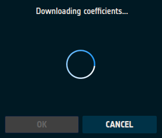
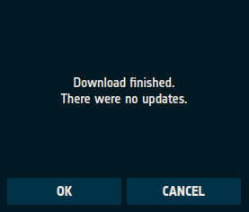
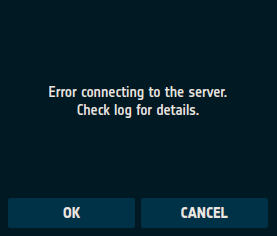
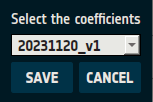

# Coefficients

LIME Toolbox requires coefficients to run its LIME model equations for reflectance (and consequently irradiance) and
for the Degree of Lunar Polarisation (DoLP).

These models are continuously updated, improving their accuracy with each new coefficient release.

## Updating the Coefficients

To update the coefficients, navigate to "Coefficients → Download updated coefficients" in the action menu bar.

A window will appear indicating that the coefficient download is in progress, as shown in [Figure 21](#fig-21).

<figure align="center" id="fig-21">
    
    <figcaption><i>Figure 21</i>: Coefficients download in progress.</figcaption>
</figure>


Once the process is complete, the window will display:
- The number of new coefficient versions downloaded.  
- Any errors encountered during the download.

The result may indicate that new coefficients were downloaded ([Figure 22](#fig-22))
or that no new updates were available ([Figure 23](#fig-23)).
If there was an issue connecting to the coefficients server, an error message will be displayed ([Figure 24](#fig-24)).

<figure align="center" id="fig-22">
    
    <figcaption><i>Figure 22</i>: One new coefficient version.</figcaption>
</figure>

<figure align="center" id="fig-23">
    
    <figcaption><i>Figure 23</i>: No new coefficient updates available.</figcaption>
</figure>

<figure align="center" id="fig-24">
    
    <figcaption><i>Figure 24</i>: Error downloading the coefficients.</figcaption>
</figure>

### Updating the Coefficients via CLI

Users can also update coefficients via the command-line interface (CLI) using the `-u` or `--update` option:
```sh
lime -u
```

## Selecting a Coefficients Version

To use a specific coefficient version, navigate to "Coefficients → Select coefficients" in the action menu bar.

A window will appear, displaying a dropdown menu containing all available coefficient versions ([Figure 25](#fig-25)).
To change the version:
1. Open the dropdown menu.
2. Select the desired coefficient version.
3. Click "SAVE" to confirm the selection.

<figure align="center" id="fig-25">
    
    <figcaption><i>Figure 25</i>: Selecting a coefficient version.</figcaption>
</figure>


### Choosing the Coefficients Version via CLI

To choose a different coefficient version through the CLI, use the `-C` or `--coefficients` option:  
```sh
lime -C SELECTED_COEFF_VERSION_NAME
```
This updates the coefficient version for all subsequent simulations and applies immediately to the
current simulation if used alongside any simulation or comparison option.

**Example:**
To select the coefficient version `20231120_v1`:
```sh
lime -C 20231120_v1
```
