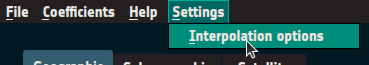
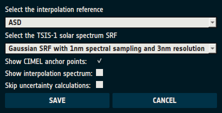

# Configuration

## Interpolation Settings

LIME Toolbox allows users to modify five settings that customize interpolation behavior and output visualization.

### Available Interpolation Settings
- **Interpolation Reference**: Defines the reference spectrum for reflectance interpolation. Options:
  - **ASD**: Uses the lunar reflectance spectrum obtained with the ASD spectroradiometer at Izaña as part of the LIME project.
  - **Apollo 16 + Breccia**: Uses ROLO's composite spectrum based on Apollo 16 Soil and Breccia samples.
- **TSIS-1 Solar Spectrum SRF**: Specifies the spectral response function of the TSIS-1 Hybrid Solar Reference Spectrum. Options:
  - **ASD**: Use the ASD spectroradiometer spectral response function.
  - **Interpolated Gaussian**: Gaussian SRF with 1nm spectral sampling and 3nm resolution.
  - **Interpolated Triangle**: Triangular SRF with 1nm spectral sampling and 1nm resolution.
- **Show CIMEL anchor points**: Enables/disables the plotting of CIMEL anchor points.
- **Show interpolation spectrum**: Controls whether the interpolation reference spectrum appears in the output plot.
- **Skip Uncertainty Calculations**: Disables uncertainty computations.
  > **Note:** Uncertainty calculations are the primary **performance bottleneck** in LIME Toolbox simulations.
  > Disabling them significantly improves speed.

### Modifying Interpolation Settings

Interpolation settings can be modified through the interpolation settings window.

1. Go to the the action menu bar and navigate to "Settings → Interpolation options" ([Figure 3](#fig-3)).

<figure align="center" id="fig-3">
    
    <figcaption><i>Figure 3</i>: Opening the Interpolation Settings Window.</figcaption>
</figure>

2. The **Interpolation Settings** window ([Figure 4](#fig-4)) will appear.
   - The first two settings are dropdowns.
   - The remaining three settings are checkboxes.
   - Click "Save" to apply changes or "Cancel" to close without saving.

<figure align="center" id="fig-4">
    
    <figcaption><i>Figure 4</i>: Interpolation Settings Window.</figcaption>
</figure>

### Command-Line Interface (CLI)

Interpolation settings can also be modified via the CLI using the `-i` or `--interpolation-settings` option.

The option must be followed by a string in JSON-formatted string, including any of the attributes in [Table 1](#tab-1).

<center id='tab-1'>

| **Attribute** | **Related Setting** | **Valid Values** |
|---------------|---------------------|------------------|
| `interp_spectrum` | Interpolation Reference | `ASD` or `Apollo 16 + Breccia` |
| `interp_srf` | TSIS-1 Solar Spectrum SRF | `asd`, `interpolated_gaussian` or "`interpolated_triangle`" |
| `show_cimel_points` | Show CIMEL anchor points | `False` or `True` |
| `show_interp_spectrum` | Show interpolation spectrum | `False` or `True` |
| `skip_uncertainties` | Skip Uncertainty Calculations | `False` or `True` |

<i>Table 1</i>: Description of CLI's Interpolation settings JSON attributes.

</center>

Example usage:
```sh
lime -i '{"interp_spectrum": "ASD", "skip_uncertainties": "False", "show_interp_spectrum": "False", "interp_srf": "interpolated_gaussian"}'
```
- Running this alone changes settings for subsequent runs.
- Running it with a simulation/comparison option updates settings for the current run and future runs.


## Logging
LIME Toolbox logs error, warning and debug messages, that range from trivial information to error descriptions.
This messages are written into text files within the logging directory which location varies depending on the operating system:
- Windows: `%appdata%\LimeTBX\`
- Mac: `~/Library/Application Support/LimeTBX/`
- Linux: `~/.LimeTBX/`

By default, LIME Toolbox logs at the `INFO` level. This means that all messages except `DEBUG`-level ones are included
in the log files. If they were included they would bloat the log files with mostly useless information. Nevertheless,
that information can be useful in case the software malfunctions. To enable `DEBUG` logging, set the environment variable
`LIME_DEBUG` to `DEBUG`.

```sh
export LIME_DEBUG=DEBUG  # Linux/Mac
set LIME_DEBUG=DEBUG     # Windows (cmd)
$env:LIME_DEBUG="DEBUG"  # Windows (PowerShell)
```
