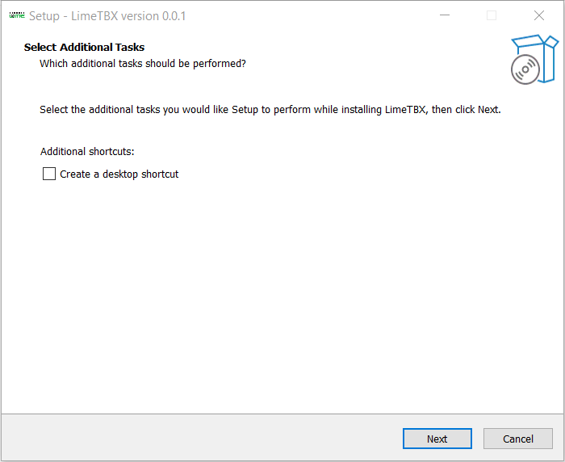
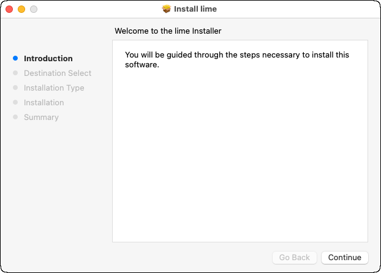

# Installation

## Prerequisites
The LIME Toolbox is only compatible with the following operating systems and architectures:
- Windows 10 (x86_64).
- Linux (x86_64, GLIBC >= 2.23)
- Mac (x86_64)
- Mac (ARM64 with Rosetta interpreter)

## Installation Steps

### Windows

1. Download the Windows install wizard.
2. Run it.
3. Follow the wizard instructions to complete the installation ([Figure 2](#fig-2)).

<figure align="center" id="fig-2">
    
    <figcaption><i>Figure 2</i>: Windows installation wizard.</figcaption>
</figure>

### Mac

1. Download the `.pkg` installer for macOS.
2. Run the `.pkg` file.
3. Follow the installation wizard instructions ([Figure 3](#fig-3)).

<figure align="center" id="fig-3">
    
    <figcaption><i>Figure 3</i>: Mac installation wizard.</figcaption>
</figure>

### Debian (Ubuntu) 

1. Download the `.deb` package
2. Install it by running:
    ```sh
    sudo dpkg -i <package> 
    ```

### Linux 

1. Download the Linux `.zip` installer.
2. Extract the files into a directory.
3. Run the installer inside that directory:
    ```sh
    sudo ./lime_installer.sh 
    ```
4. Cleanup (optional): You can delete the `.zip` file and extracted data after installation.
